# QI-Q_Hardware

此文档用于齐奇战队硬件组培训使用，包含了从0开始学习超级电容的大部分知识点

# 前言

该笔记为笔者个人在两年的硬件学习中对各种硬件知识的一些个人的理解，部分资料来自网络。该笔记可用于齐奇战队硬件组培训以及自学使用，笔者能力有限，有不全可以自行上网搜索补充。希望各位能够在该笔记中有所收获，为齐奇战队的RM之路做出一份贡献。

# 一、认识基本电子元器件

## 电子元器件及封装的概念

电子元器件是电子元件和小型的机器、仪器的组成部分，其本身常由若干零件构成，可以在同类产品中通用；常指电器、无线电、仪表等工业的某些零件，是电容、晶体管、游丝、发条等电子器件的总称。常见的有电阻、电容、电感、二极管、三极管和mos管等。

封装，就是指把硅片上的电路管脚，用导线接引到外部接头处，以便于其它器件连接。我们说的封装一般指电子元器件的外形，引脚布局规格。

## 电阻器

### 电阻的定义

电阻器（Resistor）在日常生活中一般直接称为电阻。是一个限流元件，缩写为R，单位为欧姆（Ω），在电路中能够阻碍电流并造成能量损耗。

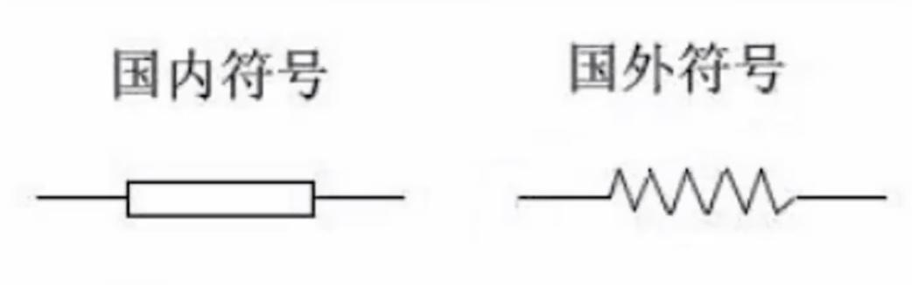

### 电阻分类

一般我们将电阻按照封装和实际用途两个标准分类。

#### 按照封装

电阻按照封装可分为贴片电阻和插件电阻。

##### 贴片电阻

贴片电阻是我们在**电路设计中最常用**的一种电阻，有以下特点：

1. 体积小，重量轻
2. 电性能稳定

贴片电阻的封装类型一般用数字表示，如0201、0402、0603、0805、1206、1210等，我们在电路设计中最常用的是0603封装。

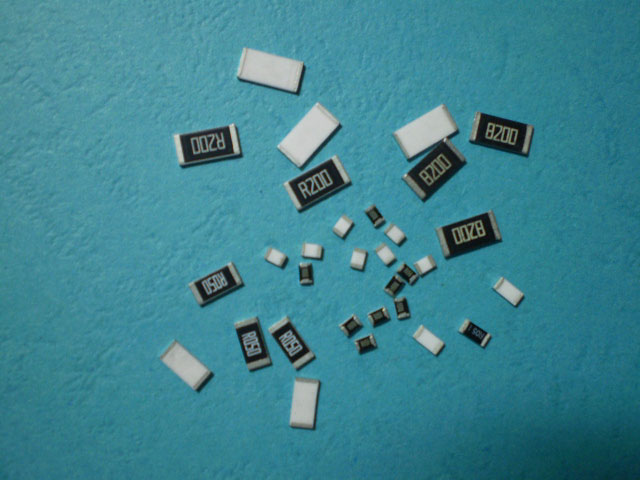

##### 插件电阻

插件电阻在生活中比较常见，但我们**不常用于pcb设计**，有以下特点：

1. 可通过双引线或单引线轻松插入市场上各种通用板子
2. 具有较高的温度稳定性，可在广泛的工作温度范围内工作

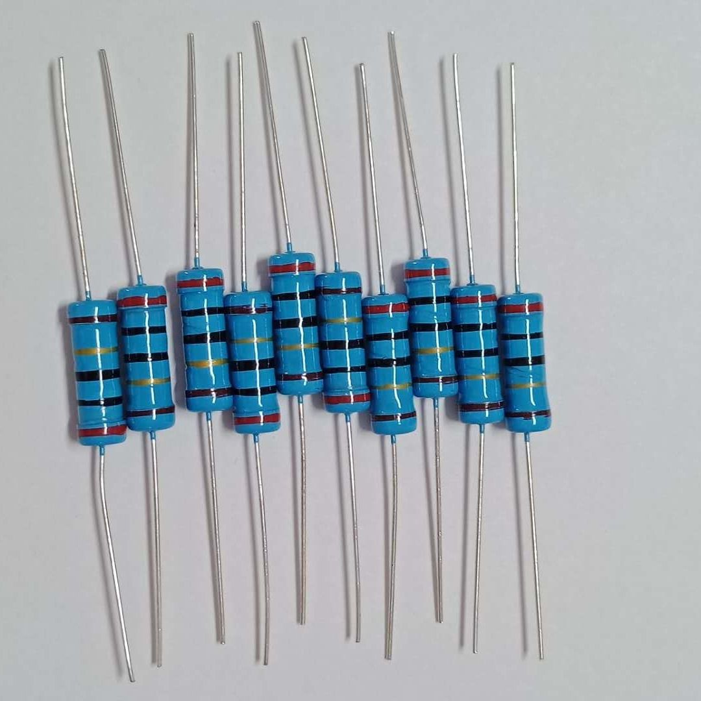

#### 按照实际用途

电阻按照实际用途可分为功率电阻、可调电阻、特殊电阻。

##### 功率电阻

功率电阻是一种很常见的电阻，在电路中起到限制电流，消耗功率的作用，一般**用于需要消耗大功率的电路**中，有以下特点：

1. 电阻值较低
2. 功率承载能力较高
3. 耐高温性能好
4. 稳定性较好

##### 可调电阻

可调电阻包括滑动变阻器、电阻箱、电位器，大小可以人为调节，前两者一般用于实验等，电位器是我们设计pcb时相对常用的，这里着重介绍电位器。

电位器的电阻体有两个固定端，通过手动调节转轴或滑柄，改变动触点在电阻体上的位置，则改变了动触点与任一个固定端之间的电阻值，从而改变了电压与电流的大小。电位器**一般用于各类传感器**，用来调节传感器的灵敏度，从而达到要求。

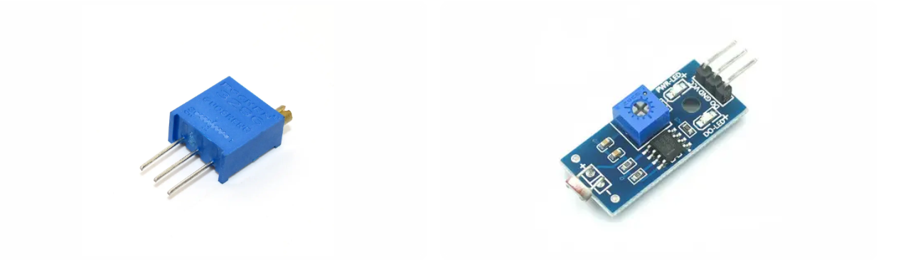

##### 特殊电阻

特殊电阻包括压敏电阻、热敏电阻、光敏电阻等。一般常用于各种开关、传感器等。

### 电阻器的数标法

数标法即数码标示法，主要用于贴片等体积小的电阻，主要用三位数表示阻值，前两位表示有效数字，第三位数字是乘10的次幂。 电阻上标注“ABC”，其阻值为AB*10的c次方。其中如果在数前有R，**R表示0.**，有时也用四位数，只有最后一位数表示10的几次方，前面数仍然是有效数字。

例如：R12表示0.12Ω

​     122表示1200Ω，即1.2KΩ

​     1402表示14000Ω，即14KΩ

### 电阻的应用

1. 限流电路

电阻器可以用来限制电路中的电流大小，保护其他元件。

例如，在LED电路中，为了保护LED不受过大电流的损害，可以串联一个适当的电阻来限制电流。

2. 分压电路

电阻器可以用来分压，将高电压转换为低电压，以适应其他元件的工作范围。

例如，在电压表测量高电压时，可以通过串联一个适当的电阻来将电压分压到表头的工作范围内。

3. 电压调节

可变电阻器可以用来调节电路中的电压，实现对电路的精确控制。

例如，在音量调节器中，可以使用一个可变电阻器来调节音量大小。

4. 信号匹配

电阻器可以用来匹配电路中的信号阻抗，以提高信号传输的质量。

例如，在音频放大器中，可以使用电阻器来匹配输入和输出的阻抗，以提高音频信号的传输效果。

5. 电流检测

通过电阻器的电压降来检测电路中的电流大小，实现电流监测和保护。

例如，在电池充电器中，可以使用一个电阻器来检测电池的充电电流，以控制充电电流的大小。

6. 温度传感器

电阻器的电阻值会随着温度的变化而变化，可以利用这一特性制作温度传感器。

例如，热敏电阻器（PTC和NTC）可以根据温度的变化来改变电阻值，从而实现温度测量和控制。

## 电容器

### 电容的定义

两个相互靠近的导体，中间夹一层不导电的绝缘介质，这就构成了电容器，简称电容。当电容器的两个极板之间加上电压时，电容器就会储存电荷。电容器的电容量在数值上等于一个导电极板上的电荷量与两个极板之间的电压之比。电容器的电容量的基本单位是法拉(F)。在电路图中通常用字母C表示电容器。电容有以下特点：

1. 具有储能能力
2. 电压无法突变
3. 通高频阻低频
4. 通直流阻交流

### 电容分类

电容一般分为有极性电容和无极性电容。

#### 有极性电容

有极性电容是指电解电容一类的电容，它是由阳极的铝箔和阴极的电解液分别形成两个电极，由阳极铝箔上产生的一层氧化铝膜做为电介质的电容。例如铝电解电容、钽电容、固态电容等。**有极性电容一般用于电源****滤波**，它具有以下特点：

1. 有极性电容(如铝电解)容量可以做的很大，但其高频特性不好，但也有高频特性好的有极性电容——钽电解，它价格比较高;
2. 有极性电容大多采用电解质做介质材料，通常同体积的电容有极性电容容量大。

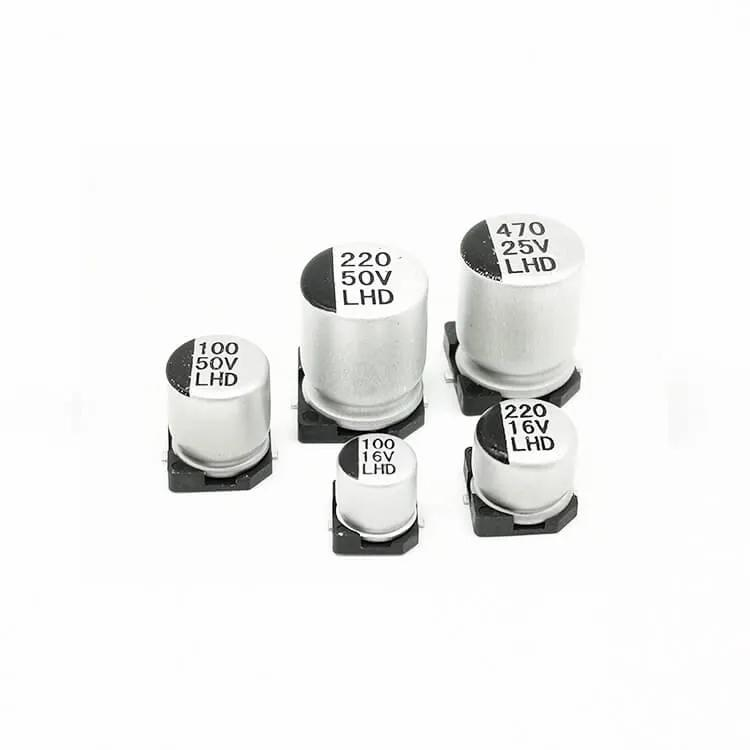

#### 无极性电容

无极性电容就是没有极性电源正负极的电容器，如陶瓷电容器，即贴片电容。无极性电容器的两个电极可以在电路中随意的接入。无极性电容的封装规格与贴片电阻一致，并且都可以用数标法表示，容值单位为pF。**无极性电容一般用于高频****滤波****和震荡电路，电源滤波也会用到**，它具有以下特点：

1. 磁介电容器性能稳定
2. 损耗，漏电很小

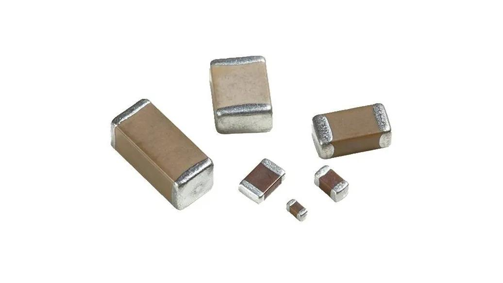

### 电容的应用

1. 储存电荷

电容器最基本的功能之一是储存电荷。当电容器充电时，电荷会在电极之间积累。这种储存电荷的能力使得电容器在许多电子设备中得到广泛应用。

例如，电子闪光灯中的电容器可以储存电荷，当需要时释放电荷，产生强烈的闪光。类似地，电子钟中的电容器可以储存电荷，以保持时间的准确性。

2. 滤波

电容器可以用作滤波器，将电路中的高频噪声滤除，使信号更加纯净。在许多电子设备中，滤波是非常重要的，以确保信号的质量。

例如，在音频放大器中，可以使用电容器来滤除输入信号中的高频噪声，提高音频信号的质量。电容器的电容值和频率响应特性可以根据具体的应用要求进行选择。

3. 耦合

电容器可以用来实现信号的耦合，将一个电路的信号传递到另一个电路中。这在放大器电路中非常常见。

例如，在放大器电路中，可以使用电容器将输入信号耦合到放大器的输入端，以实现信号的传递和放大。电容器的电容值和频率响应特性对信号的传输和放大起着重要的作用。

4. 时序控制

电容器可以用来实现时序控制，如延时和脉冲生成。通过充放电过程，可以控制电容器的充放电时间，从而实现对电路的时序控制。

例如，通过控制电容器的充电时间，可以实现延时电路。类似地，通过充放电过程，可以生成脉冲信号，用于触发其他电子元件的工作。

5. 电源稳压

电容器可以用来平稳化电源电压，减小电源的纹波。在电源滤波电路中，可以使用电容器来平滑电源电压，提供稳定的电源输出。

电容器的电容值和电压额定值需要根据电源的要求进行选择。较大的电容值可以提供更好的电源稳压效果。

6. 传感器

电容器的电容值会随着周围环境的变化而变化，可以利用这一特性制作传感器。例如，湿度传感器可以利用电容器的电容值随湿度变化而变化，从而实现湿度的测量和控制。

这种基于电容变化的传感器在许多应用中都有广泛的应用，如温度传感器、湿度传感器、压力传感器等。

## 电感器

### 电感的定义

电感器(Inductor)是能够把电能转化为磁能而存储起来的元件。电感符号为L，单位为亨（H）电感器具有一定的电感，它只阻碍电流的变化。如果电感器在没有电流通过的状态下，电路接通时它将试图阻碍电流流过它；如果电感器在有电流通过的状态下，电路断开时它将试图维持电流不变。电感器又称扼流器、电抗器、动态电抗器。电感具有以下特点：

1. 具有储能能力
2. 电流无法突变
3. 通低频阻高频
4. 通直流隔交流

### 电感分类

常见的电感有功率电感、贴片电感、共模电感和差模电感，这里我们只着重介绍前两个。

#### 功率电感

功率电感一般指能承受大功率的电感器，在电路中**主要起滤波和振荡作用，常用于低频LC滤波**。

特点如下：

1. 高导磁率，低损耗
2. 体积小，便于安装
3. 高功率，高磁饱和性，低阻抗

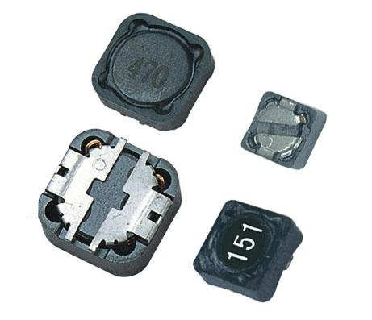

#### 普通贴片电感

普通贴片电感常用于**高频信号滤波还有一些小信号滤波**，具有以下特点：

1. 感值小，功率小，饱和电流小
2. 高能量储存，低阻抗

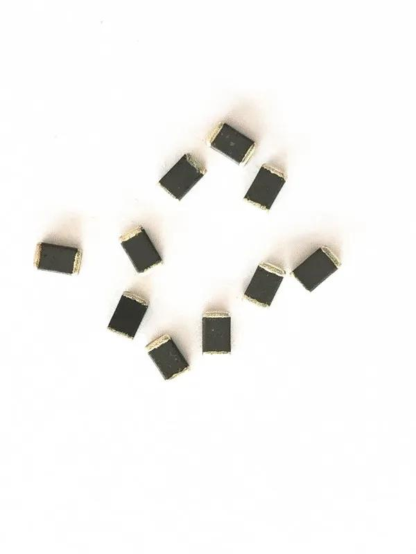

### 电感的应用

1. 储存能量

电感器可以储存电能，并且在电流变化时释放电能。当电流通过电感器时，磁场会储存电能。当电流发生变化时，磁场也会发生变化，从而导致电感器释放储存的电能。

这种储存能量和释放能量的特性使得电感器在许多电子设备中得到广泛应用。例如，变压器中的电感器可以储存和传输电能，用于电力传输和转换。

2. 滤波和抑制噪声

电感器可以用作滤波器，通过阻碍或通过特定频率的信号来滤除电路中的噪声。电感器对高频信号有较高的阻抗，可以阻碍高频噪声的传输。

因此，电感器在电子设备中常用于滤除高频噪声，提高信号质量。例如，在收音机中，电感器可以用于滤除电源线上的高频噪声，以保证音频信号的清晰度。

3. 耦合和变压

电感器可以用来实现电路之间的耦合和变压。当两个电感器靠近时，它们的磁场会相互耦合，从而传递能量和信号。

这种耦合特性使得电感器在变压器中得到广泛应用。变压器通过电感器之间的相互耦合，可以实现电压的升降。

4. 时序控制

电感器可以用来实现时序控制，例如延时和振荡。通过改变电感器的电感值和电流变化速率，可以控制电感器的响应时间和频率。

例如，在振荡电路中，电感器可以与电容器和电阻器组合使用，产生稳定的振荡信号。这种时序控制特性在许多电子设备中得到广泛应用，如时钟、计时器和发生器。

5. 传感器

电感器的电感值可以随着周围环境的变化而变化，可以利用这一特性制作传感器。例如，温度传感器可以利用电感器的电感值随温度变化而变化，从而实现温度的测量和控制。

这种基于电感变化的传感器在许多应用中都有广泛的应用，如温度传感器、湿度传感器、压力传感器等。

## 二极管

### 二极管的定义

#### PN结

采用不同的掺杂工艺，通过扩散作用，将P型半导体与N型半导体制作在同一块半导体（通常是硅或锗）基片上，在它们的交界面就形成空间电荷区称为PN结（英语：PN junction）。PN结具有单向导电性，是电子技术中许多器件所利用的特性，例如半导体二极管、三极管的物质基础。

#### 二极管

二极管是用半导体材料(硅、硒、锗等)制成的一种电子器件。二极管有两个电极，正极，又叫阳极；负极，又叫阴极，给二极管两极间加上正向电压时，二极管导通， 加上反向电压时，二极管截止。 二极管的导通和截止，则相当于开关的接通与断开。二极管具有以下特性：

1. 单向导电性
2. 外加反向电压超过某一数值时，反向电流会突然增大，这种现象称为电击穿。引起电击穿的临界电压称为二极管反向击穿电压。电击穿时二极管失去单向导电性。如果二极管没有因电击穿而引起过热，则单向导电性不一定会被永久破坏，在撤除外加电压后，其性能仍可恢复，否则二极管就损坏了。因而使用时应避免二极管外加的反向电压过高。

> 二极管内部一般有0.7V的压降。

### 二极管的分类

二极管主要按用途来分类，主要有整流二极管、开关二极管、**稳压二极管**、检波二极管、**肖特基二极管**、发光二极管、变容二极管、光敏二极管等。

#### 肖特基二极管

对于肖特基二极管，需要特别说明，它不是利用P型半导体与N型半导体接触形成PN结原理制作的，而是利用金属与半导体接触形成的金属－半导体结原理制作的。所以肖特基二极管也称为金属－半导体（接触）二极管或表面势垒二极管，它是一种热载流子二极管。

特点：开关频率高，为反向恢复时间极短(可以小到几纳秒)，正向压降低，正向导通压降仅0.4V左右。

缺点：耐压比较低，漏电流稍大些。

用途：多用作高频、低压、大电流整流二极管、续流二极管、保护二极管，也有用在微波通信等电路中作整流二极管、小信号检波二极管使用。在通信电源、变频器等中比较常见，一般来说，能用肖特基二极管就不用普通二极管，但是一些特殊情况除外。

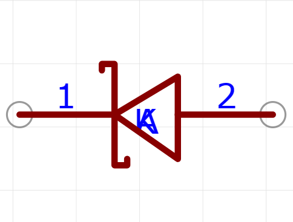

#### 稳压二极管

稳压二极管，又叫齐纳二极管。利用PN结反向击穿状态，其电流可在很大范围内变化而电压基本不变的现象，制成的起稳压作用的二极管。

特性：稳压值等于反向击穿电压。

注意应用中需要串联一个限流电阻。

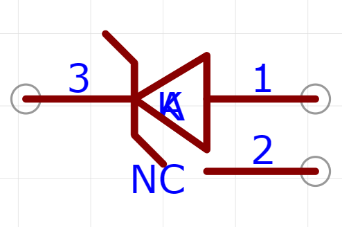

#### 光敏二极管

光敏二极管，又叫光电二极管、光电池，是一种能够将光根据使用方式，转换成电流或者电压信号的光探测器。光敏二极管可以利用光照强弱来改变电路中的电流，一般来说光线越强，电流越大。

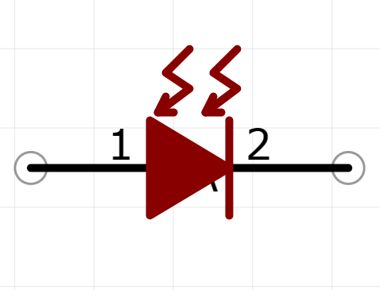

#### 发光二极管

发光二极管：LED，是一种常用的发光器件，通过电子与空穴复合释放能量发光。在平时单片机上用的LED就是发光二极管，在使用过程中，发光二极管发光的强弱和流过他的电流成正比，所以如果觉得光弱，可以降低和他串联的电阻，但是要注意他能够承受的最大电流，防止损坏。

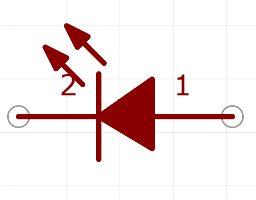

### 二极管的应用

1. 整流

二极管可以用作整流器，将交流信号转换为直流信号。当交流信号通过二极管时，它只能在一个方向上通过，而在另一个方向上被阻止。这种性质使得二极管可以将交流信号的负半周期去除，从而得到纯净的直流信号。

整流器广泛应用于电源、电动机控制和通信设备等领域。

2. 保护

二极管可以用作电路的保护装置，防止过电压和反向电压对电路和元件的损坏。当电路中出现过电压或反向电压时，二极管可以将过电压或反向电压导向地，从而保护其他元件不受损坏。

保护二极管常用于电源电路、通信线路和电子设备中，以保护其免受电压波动和电磁干扰的影响。

3. 开关

二极管可以用作开关，控制电路的通断。当二极管正向偏置时，它处于导通状态，电流可以通过。而当二极管反向偏置时，它处于截止状态，电流无法通过。

这种开关功能使得二极管在数字电路、计算机逻辑门和存储器等应用中得到广泛应用。

4. 检波

二极管可以用作检波器，将高频信号转换为低频信号。当高频信号通过二极管时，它只能在一个方向上通过，而在另一个方向上被阻止。这种性质使得二极管可以将高频信号的振荡部分去除，从而得到低频信号。

检波器广泛应用于通信、广播和音频设备中，用于解调和提取信号。

5. 发光

某些特殊类型的二极管，如发光二极管（LED），可以将电能转化为光能。当电流通过LED时，它会发出可见光，用于指示、照明和显示等应用。

LED广泛应用于电子产品、照明设备和显示屏等领域，由于其高效、长寿命和可调光性能而受到青睐。

## 三极管

### 三极管的定义

三极管（Transistor）是一种重要的电子器件，常用于放大和开关电路中。它由三个区别于二极管的电极组成，分别是发射极（Emitter）、基极（Base）和集电极（Collector）。

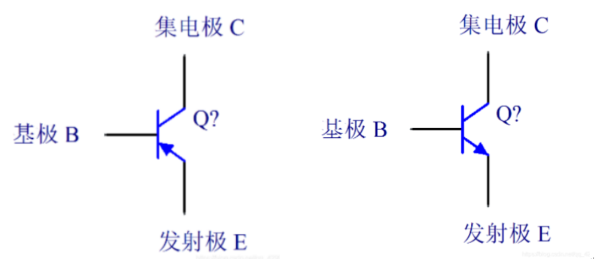

上图左为PNP型，右为NPN型。

> 三极管内部一般有0.7V的压降。

### 三极管的各类参数

1. **最大集电极电流（IC max）**

最大集电极电流是三极管可以承受的最大电流。超过这个电流，三极管可能会过热并损坏。

1. **最大集电极-基极电压（VCE max）**

最大集电极-基极电压是三极管可以承受的最大电压。超过这个电压，三极管可能会击穿并损坏。

1. **最大功耗（P max）**

最大功耗是三极管可以承受的最大功率。超过这个功率，三极管可能会过热并损坏。

1. **增益（β）**

增益是三极管的放大倍数，表示输出信号与输入信号之间的比例关系。增益越大，放大效果越好。

### 三极管的伏安特性曲线

    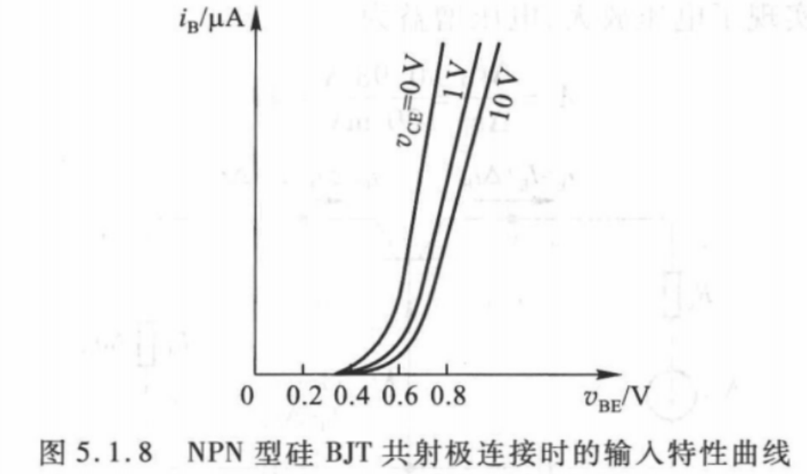
    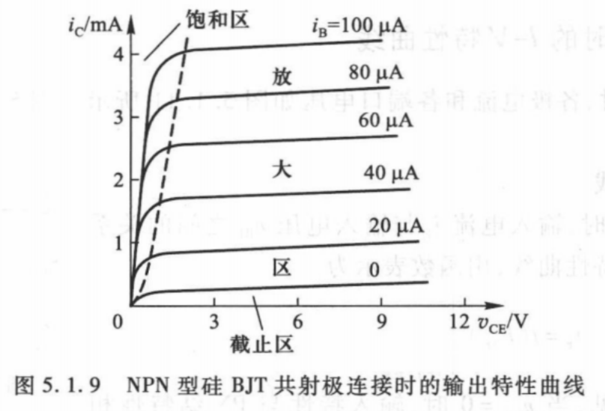

对于输入端B，有以下特点：

1. 当输入端B的电压小于一定阈值时，输入电流为0。当B端电压高过阈值时，随着B端电压升高，输入电流迅速增加。
2. 当输入电压固定且大于阈值时，随着输出端C电压升高，输入电流稍微降低。

对于输出端，有以下特点:

1. 当输入电流IB小于阈值时，即使输出端C电压再大，C端流进三极管的电流也几乎为0，即三极管处于关闭状态，叫做截止区。
2. 当输入电流IB大于阈值且一定时，当输出端C电压小于一定阈值时，随C端电压升高，C端电流迅速增加。当C端电压到一定值之后，随着C端电压增加，C端电流基本不再变化，将输出端C电压小于一定阈值、不同电流IB组成的区叫做饱和区，将C端电压增大但电流基本不变的区域叫做放大区。
3. 饱和区时，可以任务C端有多少电流都可以完全流进三极管里面，限制电流的是C端电压。放大区时，无论C端电压多高，C端电流都是被IB电流控制。

> 简单来说，在放大区，基级可以控制三极管分压的值

### 三极管的导通条件

NPN型导通条件：

1、 Vbe电压大于导通电压（通常为0.6V至0.7V，根据芯片资料确定，芯片资料上可能称为恒压峰值Vbe(on)）；

2、不导通的时候，相当于断路，导通的时候C端和E端之间会有一个很小的压降（芯片手册上称为集电极-发射极饱和压降，写作Vce(sat)或者Vce(on)，一般为几十到几百毫伏。

PNP型导通条件：

1、Vbe电压小于导通电压（通常为-0.6V至-0.7V，详细看芯片资料）。

2、导通的时候发射极和集电极之间也会有一个小压降。

### 三极管的应用

1. 放大作用

三极管的主要功能之一是放大信号。当输入信号施加到基极上时，它会控制发射结和集电结之间的电流。小的输入信号可以通过三极管放大为较大的输出信号。

这种放大作用使得三极管在放大器、音频设备和通信系统中得到广泛应用。

1. 开关作用

三极管还可以用作开关，控制电路的通断。当三极管处于饱和状态时，它处于导通状态，电流可以通过。而当三极管处于截止状态时，它处于断开状态，电流无法通过。

这种开关功能使得三极管在数字电路、计算机逻辑门和存储器等应用中得到广泛应用。

## MOS管

### MOS管的定义

场效应晶体管（Field Effect Transistor缩写(FET)）简称场效应管。它是利用控制输入回路的电场效应来控制输出回路电流的一种半导体器件。由于它仅靠半导体中的多数载流子导电，又称单极型晶体管。场效应管属于电压控制型半导体器件。具有输入电阻高、噪声小、功耗低、动态范围大、易于集成、没有二次击穿现象、安全工作区域宽等优点。

MOS，是MOSFET的缩写。MOSFET 金属-氧化物半导体场效应晶体管，简称金氧半场效晶体管（Metal-Oxide-Semiconductor Field-Effect Transistor, MOSFET）。一般是金属(metal)—氧化物(oxide)—半导体(semiconductor)场效应晶体管，或者称是金属—绝缘体(insulator)—半导体。

MOS管是场效应管的一种。mos管有三个引脚，分别为G：gate 栅极；S：source 源极；D：drain 漏极。MOS管主要分为NMOS和PMOS两种。在单片机中可以简单理解为栅极输入高电平时，NMOS导通，PMOS关断，低电平反之。

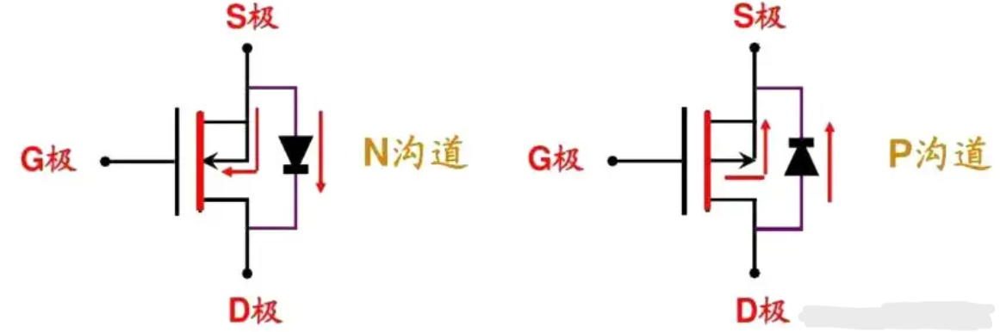

### MOS管的特点

1. 输入阻抗非常高，因为MOS管栅极有绝缘膜氧化物，甚至可达上亿欧姆，所以他的输入几乎不取电流，可以用作电子开关。
2. 导通电阻低，可以做到几个毫欧的电阻，极低的传导损耗。
3. 开关速度快，开关损耗低，特别适应PWM输出模式。
4. 在电路设计上的灵活性大，栅偏压可正可负可零，三极管只能在正向偏置下工作，电子管只能在负偏压下工作；
5. 低功耗、性能稳定、抗辐射能力强，制造成本低廉与使用面积较小、高整合度。
6. 极强的大电流处理能力，可以方便地用作恒流源。
7. **MOS管栅极很容易被静电击穿**，栅极输入阻抗大，感应电荷很难释放，高压很容易击穿绝缘层，造成损坏。

### MOS管的各类参数

1. **VGS(th)(开启电压)**

当外加栅极控制电压 VGS 超过 VGS(th) 时，漏区和源区的表面反型层形成了连接的沟道。

应用中，常将漏极短接条件下 ID 等于 1 毫安时的栅极电压称为开启电压。此参数一般会随结温度的上升而有所降低。

**MOS管的导通条件**

MOS管的开关条件：

N沟道：导通时 Vg> Vs,Vgs> Vgs(th)时导通；

P沟道：导通时 Vg< Vs,Vgs< Vgs(th)时导通。

MOS管导通条件：|Vgs| > |Vgs(th)|

1. **VGS(最大栅源电压)**

栅极能够承受的最大电压，栅极是MOS管最薄弱的地方，设计的时候得注意一下，加载栅极的电压不能超过这个最大电压。

1. **RDS(on)(漏源电阻)**

导通时漏源间的最大阻抗，它决定了MOSFET导通时的消耗功率。这个值要尽可能的小，因为一旦阻值偏大，就会使得功耗变大。

MOS管 导通后都有导通电阻存在，这样电流就会在这个电阻上消耗能量，这部分消耗的能量叫做导通损耗。选择导通电阻小的MOS管会减小导通损耗。

现在的小功率MOS管导通电阻一般在几十毫欧左右，几毫欧的也有。

1. **ID(导通电流)**

最大漏源电流。是指场效应管正常工作时，漏源间所允许通过的最大电流。

场效应管的工作电流不应超过 ID 。

一般实际应用作为开关用需要考虑到末端负载的功耗，判断是否会超过 ID。

1. **VDSS(漏源击穿电压)**

漏源击穿电压是指栅源电压VGS 为 0 时，场效应管正常工作所能承受的最大漏源电压。

击穿后会使得 ID 剧增。

### MOS管的应用

mos管在应用时主要搭配mos驱动芯片作开关使用，也是在开关电源中经常能使用到的元器件。

Vgs电压的强弱决定了反型层的厚薄，而反型层的厚薄决定了MOS管内阻的大小，内阻的大小决定了D和S之间经过电流的大小。因此MOS也用于LDO等线性稳压电源。

# 二、电路基础知识

## 电源与地的概念

### 概念

电源通常指电子设备中的能量供应部分，它提供电能给电路工作。电源产生的电压用于驱动电路中的电流流动。

地（Ground）则是一个参考点，表示电子系统中所有电气信号的最低电位点。

### 地的分类及作用

地有很多种，我们根据作用将地分为参考地和保护地两大类，这里重点解析参考地。

#### 参考地的概念

参考地是电子系统中电信号的公共参考平面，我们讲一个信号电压是多少，电平是高还是低，都是基于参考平面说的。即便是大多数数字差分信号，发送端与接收端也要处于同一参考平面。可以说，对于相互通信的两个模块来说，参考地就是共同的基准，除了少数电气隔离的工业总线，所有的电子系统内相互连接的电路，都要有一个共同的、稳定的参考平面，这个就是参考地。

**直流地：直流电路地，零电位参考点。** **交流地：交流电的零线。应与地线区别开。**

**模拟地：放大器、采样保持器、A/D转换器和比较器的零电位参考点。**

模拟地线AGND，主要是用在模拟电路部分，如模拟传感器的ADC采集电路，运算放大比例电路等等。在这些模拟电路中，由于信号是模拟信号，是微弱信号，很容易受到其他电路的大电流影响。如果不加以区分，大电流会在模拟电路中产生大的压降，会使得模拟信号失真，严重可能会造成模拟电路功能失效。

**数字地：也叫逻辑地，是数字电路的零电位参考点。**

数字地线DGND，显然是相对模拟地线AGND而言，主要是用于数字电路部分，比如按键检测电路，USB通信电路，单片机电路等等。之所以设立数字地线DGND，是因为数字电路具有一个共同的特点，都属于离散型的开光量信号，只有数字“0”和数字“1”区分，在由数字“0”电压跳变成数字“1”电压的过程中，或者由数字“1”电压跳变成数字“0”电压的过程中，电压产生了一个变化，根据麦克斯韦电磁理论，变化的电流周围会产生磁场，磁场会影响到其他电路。

**功率地：大电流网络器件、功放器件的零电位参考点。**

在大功率电路中，如电机驱动电路，电磁阀驱动电路等等，也是存在一个单独的参考地线，这个参考地线叫做功率地线PGND。大功率电路，顾名思义，是电流比较大的电路。很显然大的电流，容易造成不同功能电路之间的地偏移现象，一旦电路中存在地偏移，那么原来的5V电压就可能不是5V了，而是变成了4V。因为5V电压是参考GND地线0V而言，如果地偏移使得GND地线由0V抬升到了1V，那么之前的5V（5V-0V=5V）电压就变成了现在的4V（5V-1V=4V）了。

**电源地：所有电路的0V电压参考点**

 模拟地线AGND，和数字地线DGND以及功率地线PGND，都被归类为直流地线GND。这些不同种类的地线，最后都要汇集在一起，作为整个电路的0V参考地线，这个地线叫做电源地线GND。电源，是所有电路的能量来源。所有电路工作需要的电压电流，均是来自电源。因此电源的地线GND，是所有电路的0V电压参考点。电源地是系统电源零电位的公共基准地线。由于电源往往同时供电给系统中的各个单元，而各个单元要求的供电性质和参数可能有很大差别，因此既要保证电源稳定可靠的工作，又要保证其他单元稳定可靠地工作。这就是为什么其他类型的地线，无论是模拟地线AGND，数字地线DGND还是功率地线PGND，最后都需要与电源地线GND汇集在一起

#### 为何要进行电源地与信号地之间的隔离

电源地主要是针对电源回路电流所走的路径而言的，一般来说电源地流过的电流较大，而信号地主要是针对两块芯片或者模块之间的通信信号的回流所流过的路径，一般来说信号地流过的电流很小，其实两者都是GND，如果共用的话，有可能会导致电源地上大的电流会在信号地上产生一个电压差（可以解释为：导线是有阻抗的，只是很小的阻值，但如果所流过的电流较大时，也会在此导线上产生电位差，这也叫共阻抗干扰），使信号地的真实电位高于0V，如果信号地的电位较大时，有可能会使信号本来是高电平的，但却误判为低电平。

## 基尔霍夫定律

基尔霍夫定律(Kirchhoff laws)是电路中电压和电流所遵循的基本规律，是分析和计算较为复杂电路的基础。许多电路分析中应用的定理和方法都是由基尔霍夫定律推导而来，如叠加定理、戴维南定理、回路电流法、节点电压法等。

基尔霍夫定律分为基尔霍夫电流定律（KCL）和基尔霍夫电压定律（KVL）。

支路:每一个二端元件称为一条支路，多个二端元件串联（电流相等）可视为一条支路。

节点:支路与支路的连接点称为结点，多个等电位的结点可视为一个节点（中间没有阻挡）。

回路:从起点出发，终点又回到起点，所形成的闭合路径称为回路（要求中间经过的结点只能经过一次）。

### 基尔霍夫电流定律（KCL）

基尔霍夫电流定律即流入电路中某节点的电流之和等于流出电流之和。

### 基尔霍夫电压定律（KVL）

基尔霍夫电压定律即闭合回路中电压升之和等于电压降之和。

## 上拉电阻、下拉电阻、推挽输出、开漏输出

### 上拉电阻

 上拉就是将不确定的信号通过一个电阻钳位在[高电平](https://baike.baidu.com/item/高电平/9753092?fromModule=lemma_inlink)，电阻同时起限流作用。上拉电阻可以提高电路驱动能力，具体应用见下文开漏输出部分。

### 下拉电阻

 下拉电阻可以将不确定的信号通过一个电阻钳位在[低电平](https://baike.baidu.com/item/高电平/9753092?fromModule=lemma_inlink)。

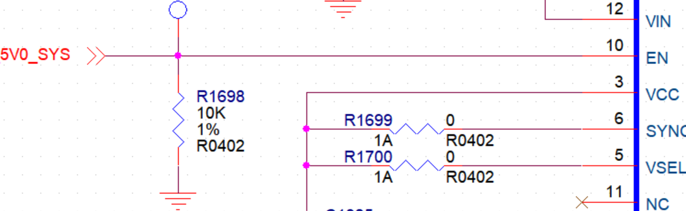

在上图中，EN引脚如果不加下拉电阻，在单片机未对该引脚输入电平时，外部电平是不稳定的，容易干扰该引脚工作，加上下拉电阻后，外部不确定的信号总是会进入GND，该引脚始终为低电平。

### 推挽输出

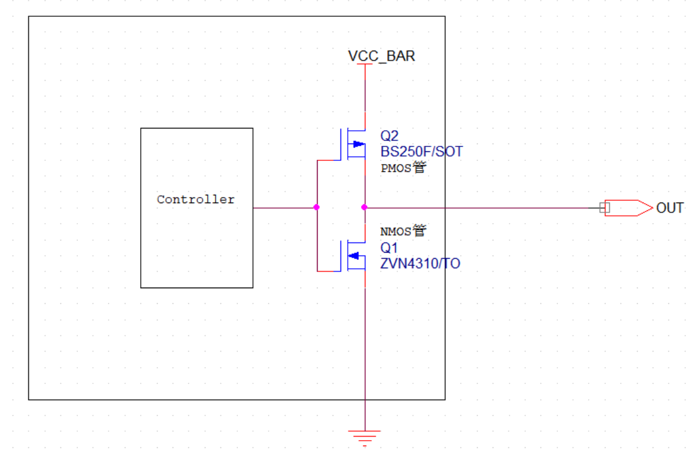

如图，上面是PMOS管，下面是NMOS管，如上图这样连接就是推挽电路，推挽电路时一种半桥电路。

上面讲过，PMOS低电平导通，NMOS高电平导通，因此：

当controller写入1时，NMOS导通，PMOS截止，相当于漏极直接接地，所以输出低电平。

当controller写入0时，NMOS截止，PMOS导通，相当于漏极连接VCC，所以输出高电平。

因此推挽输出能直接输出高低电平。

### 开漏输出

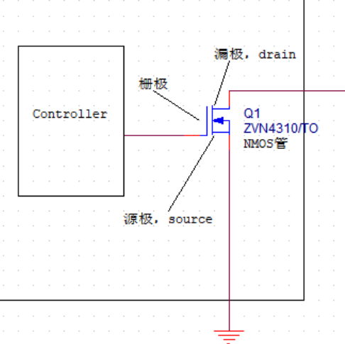

如图所示为开漏输出的电路，开漏输出顾名思义就是开放mos管的漏极。

当controller写入1时，mos导通，相当于导线，相当于漏极直接接地，所以是输出低电平。 当controller写入0时，mos不导通，外面悬空了，相当于漏极连的东西是未知的，可能随负载的电平而变化，所以不能确定电平。

因此引入上拉电阻。

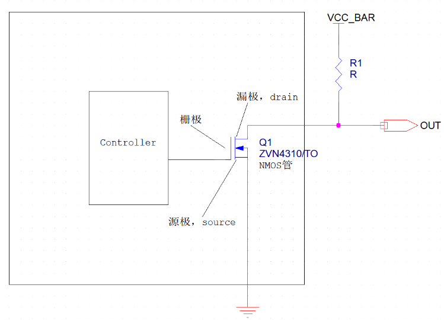

如图，连接上拉电阻后，

当controller写入1时，mos导通，相当于导线，vcc、电阻和地形成回路，所以是OUT端口输出低电平。 当controller写入0时，mos不导通，vcc、电阻和地形成回路，所以是OUT端口被拉到VCC，输出高电平。

# 三、H桥电路和高边MOS自举电路

## H桥电路

### H桥的定义

H桥，又称全桥，是一种电子电路，可使其连接的负载或输出端两端电压反相/电流反向。

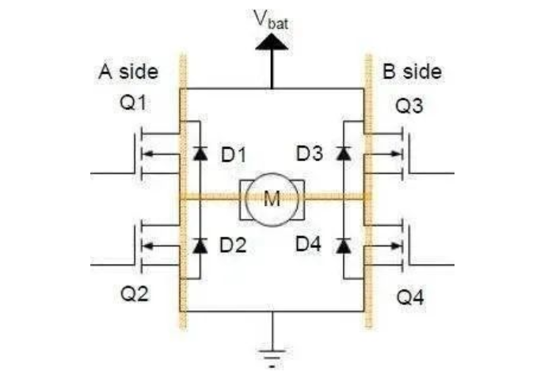

上图就是一种很常见的H桥电路，H桥电路多用于电机驱动等需要进行电压反相或者电流反向的电路。上图中将电机换成电感就是常见的**四开关双向升降压（BUCK-BOOST）电路**，也就是我们硬件组最重要的目标---超级电容的基本拓扑，关于BUCK-BOOST电路后面再作详解。

> H桥是一个典型的直流电机控制电路，因为它的电路形状酷似字母H，故得名曰“H桥”。

### H桥的开关状态分析

下面以控制一个直流电机为例，对H桥电路的运作方式展开具体分析。

#### 电机正转

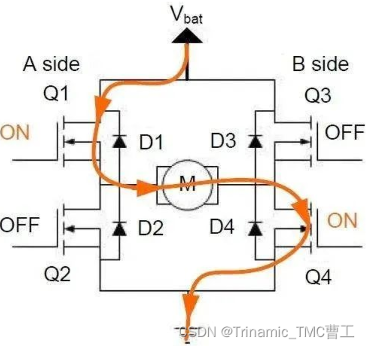

如图，当Q1、Q4开启，Q2、Q3关断时，此时电路中电流方向如图所示，电机正转。

#### 电机反转

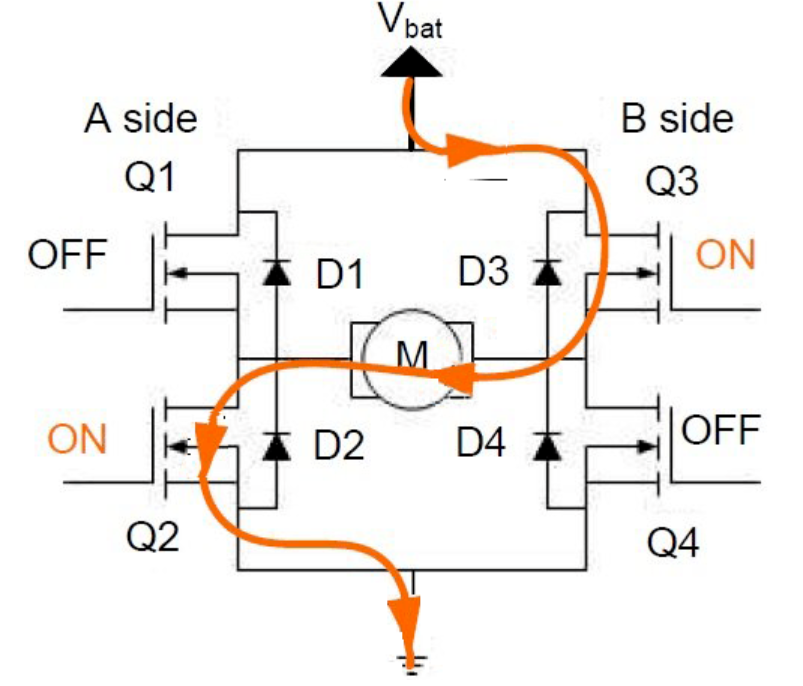

如图，当Q2、Q3开启，Q1、Q4关断时，此时电路中电流方向如图所示，电机反转。

#### 电机停转

这里以电机从正转切换到停止状态为例，正转时Q1和Q4是打开状态，这时候如果关闭Q1和Q4，直流电机内部可以等效成电感，也就是感性负载，电流不会突变，那么电流将继续保持原来的方向进行流动，这时候我们希望电机里的电流可以快速衰减。

电机停转有两种方式，如下：

**第一种：**

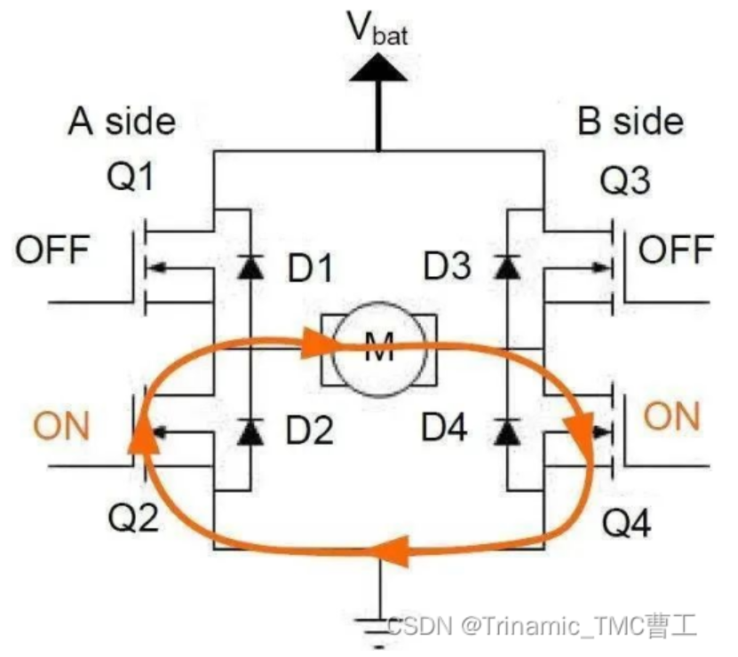

如图，打开Q2、Q4，关闭Q1、Q3，残余电流通过Q2、Q4形成回路，通过mos管内阻将剩余电流消耗掉。

**第二种：**

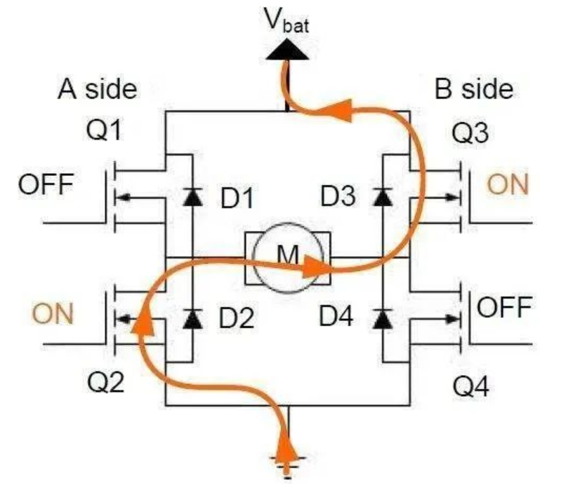

如图，关闭Q1和Q4，这时候电流仍然会通过反向续流二极管进行流动，此时可短暂打开Q1和Q3从而达到快速衰减电流的目的。

#### 电机调速

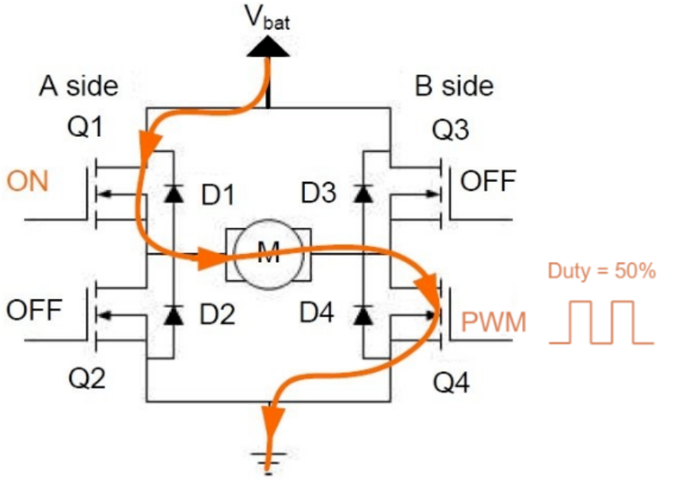

如图，关闭Q2和Q3，打开Q1 ，Q4上给它输入50%占空比的PWM波形，这样就达到了降低转速的效果，如果需要增加转速，则将输入PWM的占空比设置为100%。

> PWM调速原理：
>
> 以STM32单片机为例，其IO口只能输出高电平和低电平。
>
> 假设高电平为3.3V、低电平则为0V，那么要输出不同的模拟电压就要用到PWM。通过改变IO口输出的方波的占空比，从而获得使用数字信号模拟成的模拟电压信号。具体可以理解为一个不断求平均值的过程。
>
> 电压是以一种脉冲序列被加到模拟负载上去的，接通时是高电平1，断开时是低电平0。接通时直流供电输出，断开时直流供电断开。通过对接通和断开时间的控制，理论上来讲，可以输出任意不大于最大电压值3.3V的模拟电压。
>
> 比方说，占空比为50%那就是高电平时间一半，低电平时间一半。在一定的频率下，就可以得到模拟的1.65V输出电压。那么75%的占空比，得到的电压就是2.47V。

## 高边MOS自举电路

上面我们学习了H桥电路，那么我们能否用单片机直接给予电平来控制MOS管呢？显然是不能的。我们知道MOS管的导通条件是|Vgs| > |Vgs(th)|，但实际上这个Vgs(th)指的是低于该电压MOS管就会关断，而要想让MOS管真正导通则需要根据参考手册,我们以BSC070N10NS5型号NMOS为例，下图是他的参考手册中的一部分。

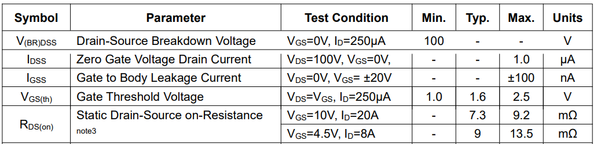

图中表明，该MOS管的Vgs(th)为1V-2.5V，这意味着当电压小于1V时，MOS管关断，而下方Rds(on)所对应的两个Vgs则代表当Vgs为4.5V-10V时，Rds(on)为13.5mΩ-9.2mΩ，即当电压在4.5V-10V这个区间时，MOS管有效导通。我们假设驱动该MOS管的单片机高电平电压为5V（常见的单片机如Arduino的IO口高电平就是5V），那么对于H桥的下管，在高电平时，MOS管导通，低电平时，电压为0V，MOS管关断，可以正常驱动；对于上管，我们需要具体分析，这里给出一个H桥电路，当单片机给栅极高电平时，MOS管导通，此时Vg=5V，Vs=12V，此时Vgs=-7V<1V,这时的Vgs不满足MOS管导通的条件，在MOS管开启的瞬间就会关断，这时候我们就需要搭建一个电路，使得单片机输出高电平时让Vgs始终处于4.5V-10V，在单片机输出低电平时Vgs<=Vgs(th)，满足这个要求的电路就是**高边MOS自举电路**。

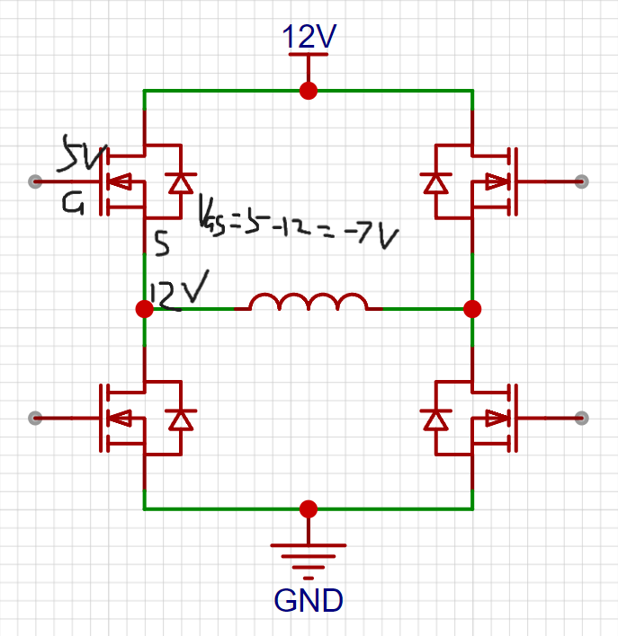

### 基本拓扑讲解

下图为高边MOS自举电路的基本拓扑。

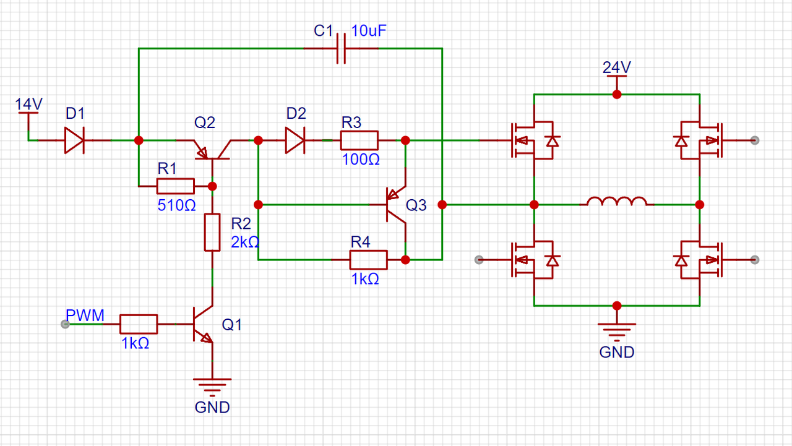

如图，我们将在PWM分别输出0和1两种情况下进行分析。

**当PWM=1时：**

Q1的Vbe<-0.7V，Q1导通；Q2的B级通过Q1接地，Vbe>0.7V,Q2导通；此时14V直接通过D1、Q2、R3，经过两次压降，大约12V到达MOS管G级；对于Q3，由于经过二极管产生0.7V压降，Q3的Vbe<0.7V，Q3关断，此时MOS管满足导通条件，MOS管导通，Vs=24V；Vs的24V与电容C1的右端相连，C1的右端便被抬高到24V，而根据电容两端电压不突变的特性，另一端也应该是24V，此时，电容左端的24V与原本的14V共同通过D1、Q2、R3，经过两次压降后最终有36V的电压稳定加在MOS管的G级上，使得MOS管一直导通，而对于此时的Q3，由于有R4产生的压降存在，始终不会导通。至此完成了PWM=1时MOS管导通的分析。但是我们知道，电容内部电荷量有限，不能一直给MOS管G级供给高电压，此时就需要对该电容充电。

**当PWM=0时：**

Q1关断，因此Q2关断，此时MOS管的G级仍保留有残余电荷，只能释放至Q3的E极，此时Vbe>0.7V，Q3导通，MOS管G极电荷通过Q3释放至S极，MOS管不满足导通条件，MOS管关断。此时，由于电感电流不能发生突变，需要续流，电流就会沿着下管绕回，此时连接C1右端的电压就因为二极管产生0.7V的压降，电压变为-0.7V，这时电源14V就向电容充电，这个过程很快就能完成。

至此便完成了一个PWM周期，之后往复循环，便完成了PWM控制。上面拓扑中用于抬升电压的电容称为自举电容。

### 栅极驱动芯片的使用

在现实中，主动搭建这样一个电路对于硬件要求太高，因此我们可以使用集成芯片。栅极驱动芯片便是将上面的自举升压电路集成到一块芯片里，这里我们以德州仪器的UCC27211芯片为例进行讲解。

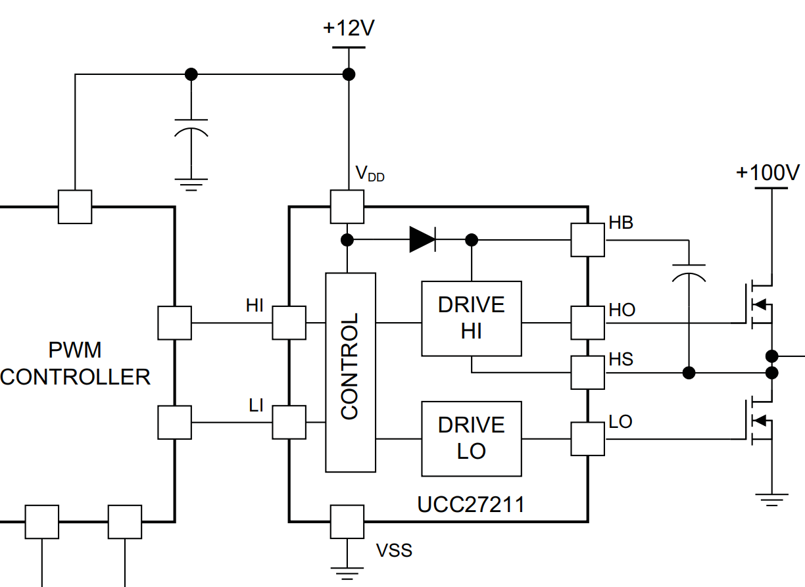

上图是UCC27211的典型应用电路。LI控制下管，HI控制上管，只要给HI输入PWM信号，便可达到上面我们讲解的高边MOS自举电路的效果，即当PWM=1时，HO引脚可输出VDD+VIN的电压，在图中就是112V电压，而PWM=0时，HO输出电压就为0，但要注意，这个电压也是有上限的，该芯片最高可允许120V电压通过。此处HB和HS中间的电容即自举电容，具体取值可查看参考手册。其他注意事项也应按照参考手册来，其他芯片也是一样，在参考手册中寻找信息再进行设计。

# 四、集成运算放大器

## 运算放大器的定义

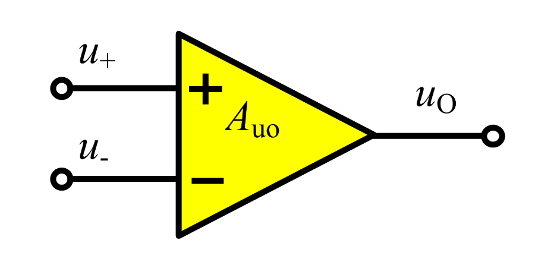

运算放大器（Operational Amplifier）是一种能够实现电信号（电压 / 电流 / 功率）放大的器件。运放拥有一对差分输入端（同相 u+ 与反相 u− 电压输入），一个单端输出端 uo，一对供电引脚 V+ 和 V−（大多数时候不画出）。它通过同相 u+ 和反相 u− 电压进行输入，在内部进行比较运算，并通过输出端 uo 放大输出。

## 运算放大器的特点

1. **无限大的输入阻抗**： 理想的运算放大器输入端不容许任何电流流入，即输入信号V+与V-两端点的电流信号恒为零，即输入阻抗无限大。
2. **趋近于零的输出阻抗**： 理想运算放大器的输出端是一个完美的电压源，无论流至放大器负载的电流如何变化，放大器的输出电压恒为一定值，即输出阻抗为零。
3. **无限大的开回路增益**： 理想运算放大器的开回路的状态下，输入端的差动信号有无限大的电压增益，这个特性使得运算放大器十分适合在实际应用时加上负反馈组态。
4. **无限大的共模抑制比**： 理想运算放大器只能对V+与V-两端点电压的差值(差分信号)有反应，即只放大V + − V − 的部份。对于两输入信号的相同的部分(共模信号)将完全忽略不计。

> **共模信号**：双端输入时，两个信号相同。
>
> **差模信号**：双端输入时，两个信号的相位相差180度。

## 运算放大器的两种工作状态

### 非线性工作状态

当运算放大器为开环或正反馈控制时，运算放大器为非线性工作状态，工作在非线性状态的集成运算放大器具有以下两个特点：

1. 当同相输入端电压大于反向输入端电压时，输出电压为高电平。
2. 当同相输入端电压小于反向输入端电压时，输出电压为低电平。

### 线性工作状态

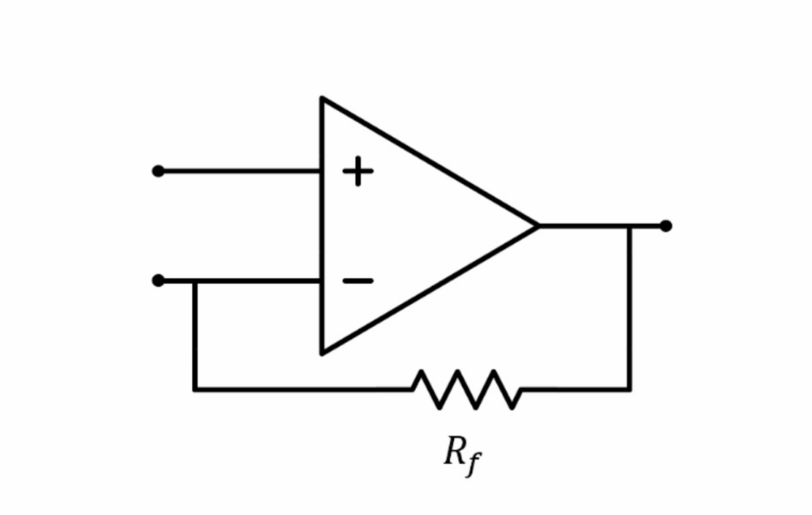

当运算放大器为负反馈控制时，运算放大器为线性工作状态，工作在线性状态的集成运算放大器有以下特点：

1. 具有虚断特性：流入和流出输入端的电流都为0，I-=I+=0A。
2. 具有虚短的特性：两个输入端的电压相等，U+=U-。

#### 虚短和虚断

**虚短**： 集成运算放大器的开环放大倍数很大，一般通用型的运算放大器的开环电压放大倍数都在80dB以上，但是运放的输出电压是有限制的，一般 在10V～14V，然而运放的差模输入电压不足1 mV，因此可以输入两端可以近似等电位，就相当于短路。 开环电压放大倍数越大，两输入端的电位越接近相等，这种特性称之为虚短。

**虚断**： 集成运算放大器具有输入高阻抗的特性，一般同向输入端和反向输入端的输入电阻都在1MΩ以上，所以输入端流入运放的电流往往小于1uA，远小于输入端外电路的电流。所以这里通常可把运放的两输入端视为开路，并且运放的输入电阻越大，同向和反向输入两端越接近开路。在运放处于线性状态时，根据这个特性可以把两输入端视为等效开路，简称虚断。

线性工作状态的应用较为广泛，也是我们要重点学习的部分。

## 运算放大器的应用及放大倍数计算

### 反相放大电路

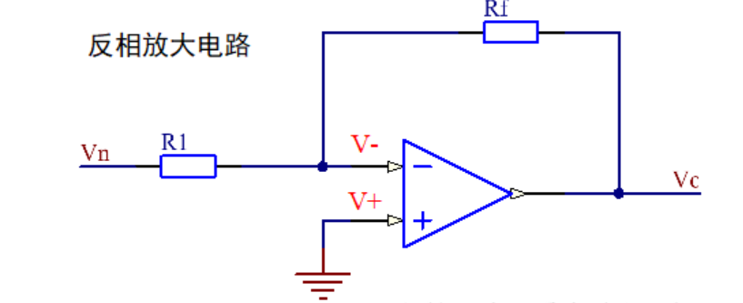

$$
由虚断推出，流过R_1和R_f的电流相等，即
\\
I_1=\frac{V_n-V_-}{R_1}
\\
I_f=\frac{V_--V_o}{R_f}
\\
由I_1=I_f得
\\
V_O=\frac{-R_f}{R_1}V_n
$$

### 同相放大电路

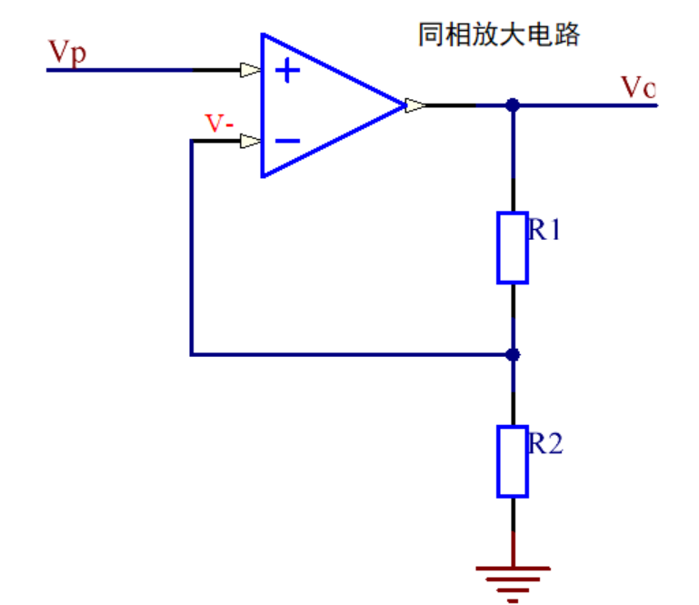
$$
由虚断推出，V_p=V_-
\\
由虚短推出，流过R_1和R_2的电流相等
\\
I=\frac{V_0}{R_1+R_2}
\\
V_p=V_-=I\cdot R_2
\\
得到V_O=\frac{R_1+R_2}{R_2}V_n
$$

### 加法电路

$$
由虚断推出，流过R_1和R_2的电流相等，流过R_3和R_4的电流相等
\\
\frac{V_1-V_+}{R_1}=\frac{V_--V_2}{R_2}
\\
\frac{V_o-V_+}{R_3}=\frac{V_--0}{R_4}
\\
由虚短得V_+=V_-
\\
若R_1=R_2，R_3=R_4，
\\
可得V_o=V_1+V_2
$$

### 减法电路

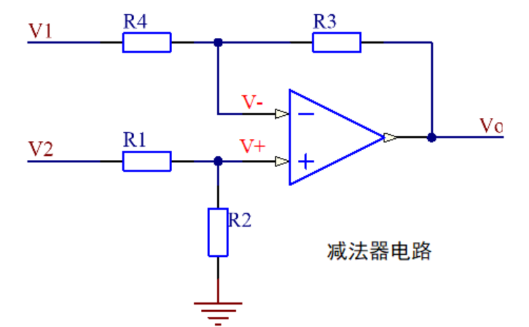
$$
由虚断推出，流过R_1和R_2的电流相等，流过R_3和R_4的电流相等
\\
\frac{V_2-V_+}{R_1}=\frac{V_+-0}{R_2}
\\
\frac{V_o-V_-}{R_3}=\frac{V_--V_1}{R_4}
\\
由虚短得V_+=V_-
\\
若R_1=R_2，R_3=R_4，
\\
可得V_o=V_2-V_1
$$

### 积分电路

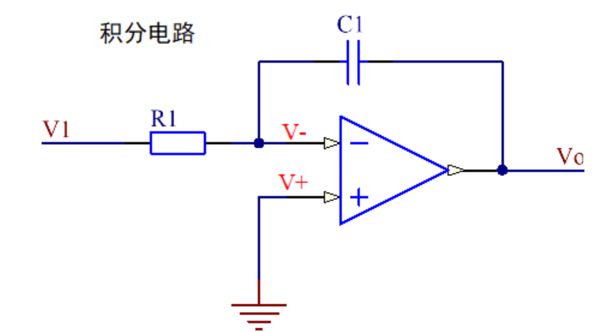
$$
由虚短可知V_+=V_-
\\
由虚断可知流过R_1和C_1的电流相等
\\
I=C\frac{\mathrm{d}u_c}{\mathrm{d}t}=-C\frac{\mathrm{d}u_o}{\mathrm{d}t}=\frac{V_1}{R_1}
\\
可推出V_o=\frac{1}{R_1C_1}\int V_1\mathrm{d}t
$$

### 微分电路

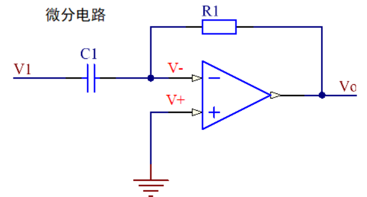
$$
由虚短可知V_+=V_-
\\
由虚断可知流过R_1和C_1的电流相等
\\
\frac{0-V_o}{R_2}=C\frac{\mathrm{d}V_1}{\mathrm{d}t}
\\
可推出V_o=-R_1C_1\frac{\mathrm{d}V_1}{\mathrm{d}t}
$$

## 采样电路

在RM比赛中，采样电路是组成超级电容控制板非常重要的电路拓扑之一，他可以采集电流和电压并利用单片机的ADC功能将模拟信号转换为数字信号，作为反馈信号，用于调节。下面两个电路分别为电压和电流的采样电路。

> 以下两种采样电路均为最简拓扑，实际应用中可以在输出端和输入端均加上电阻以均压或保护。

### 电压跟随器—电压采样

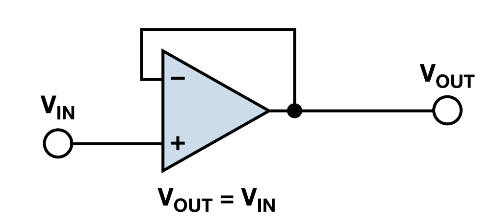

### 电流检测放大器—电流采样

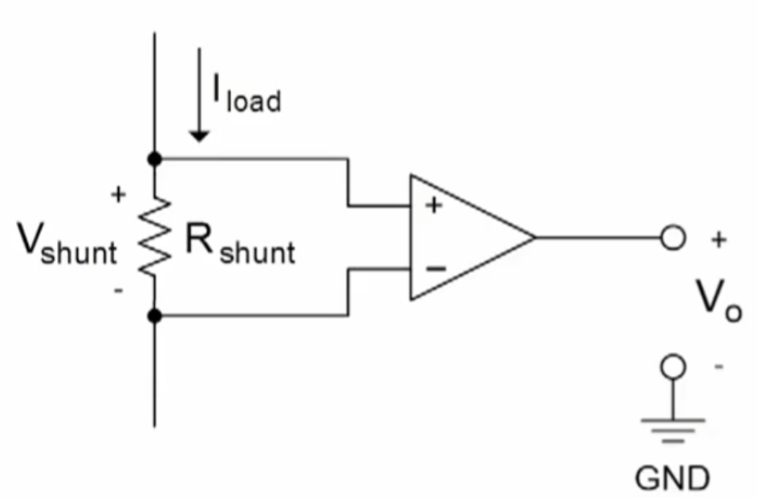

电流采样还可以用差分放大器电路。也可以用上图拓扑。

# 五、开关电源

## 电源

我们常提到的“电源”概念，指的是把其他形式的能量，如机械能、化学能、风能、热能、太阳能等直接转换成电能的装置，例如水力、风力、火力发电，以及各类电池等。
电源转换器是能够将电力能源的形式进行控制和转换的装置，它的能量变化过程是电能→电能，而非其他能量→电能。用在供电电源与负载之间，对电能进行变换或稳定处理。这里所讲的“电源”概念，实际上指的是电源转换器。

### 电源的分类

#### 根据转换的形式分类

**AC-AC（交流-交流）转换器：**如交流电源变压器、变频器等。
**AC-DC（交流-直流）转换器：**整流器。
**DC-DC（直流-直流）转换器**。
**DC-AC（直流-交流）转换器：**逆变器。

#### 根据转换的方法分类

**线性电源：**使用工作在线性区的功率器件调整管，靠调整功率管上的电压降来稳定输出。线性电源的缺点是：由于调整管静态损耗大，因此效率相对较低，且需要安装一个很大的散热器来散热；由于变压器工作在工频（50Hz）上，所以体积和重量较大。优点是稳定性高、纹波小、可靠性高，易做成多路、输出连续可调的成品。
**开关电源：**开关电源是通过控制开关管的开通和关断来输出电压的一种电源。它的优点是：与同功率档次的线性电源相比，体积小、重量轻，在高功率产品中这种差异更为明显，这是因为开关电源不需要沉重的工频变压器和很大容量的滤波电容，同时开关管功耗比线性电源调整管小得多，因此所需散热片面积比较小；开关电源的控制方式和电路拓扑决定了它的功耗小、转换效率高、稳压范围宽、滤波效率高、安全可靠、电路形式灵活。开关电源近年来一直有较大的发展，研究人员提出了包括高频化、软开关技术、谐振直流环、屏蔽技术等在内的多项新技术，很多厂家也都不断推出高性能高集成度的控制IC，使得开关电源的线路在不断简化的同时具有更可靠高效的性能。

##### 开关电源按控制方式可分为

**脉冲调制变换器：**驱动波形为方波。包括PWM调制、PFM调制、混合调制等。
**谐振式变换器：**驱动波形为使用谐振电路得到的正弦波。包括ZCS（零电流谐振开关）、ZVS（零电压谐振开关）等。

##### 按拓扑结构可分为

**隔离式：**采用变压器来实现输出与输入电气隔离。包括单管正激式（Forward）、单管反激式（Flyback）、双管正激式（Double Transistor Forward Converter）、双管反激式（Double Transistr Flyback Converter）、推挽式（Push-Pull Converter）、半桥式（Half-Bridge Converter）和全桥式（Full-Bridge Converter）等类型。
**非隔离式：**拓扑中不使用隔离变压器，输入与输出不存在电气隔离。包括降压式（Buck）、升压式（Boost）、升压降压式（Buck Boost）、Cuk DC/DC转换器、Zeta DC/DC转换器和SEPIC DC/DC转换器等类型。

#### 根据调控的效果分类

**稳压电源：**能为负载提供稳定的交流或直流电压的电源。当电网电压或负载出现波动时，输出电压保持不变。
**恒流电源：**能向负载提供恒定电流的电源，在电网电压产生波动或阻抗特性发生变化时仍能使输出电流保持恒定。现有的恒流电源的恒流范围大致为1µA～20A。它既可以为各种放大电路提供偏流以稳定其静态工作点，又可以作为其有源负载以提高放大倍数，在差动放大电路、脉冲产生电路中也得到了广泛应用。恒流电源依据其主要构成元件可以分为晶体管恒流源、场效应管恒流源、集成运放恒流源等。
**调频/变频电源：**输出电压的频率可调的（交流）电源。

> 在RM中，我们重点研究脉冲调制非隔离式DCDC稳压开关电源

### 线性稳压电源LDO

LDO（low dropout regulator，低压差线性稳压器）。这是相对于传统的线性稳压器来说的。传统的线性稳压器，如78XX系列的芯片都要求输入电压要比输出电压至少高出2V~3V，否则就不能正常工作。但是在一些情况下，这样的条件显然是太苛刻了，如5V转3.3V，输入与输出之间的压差只有1.7v，显然这是不满足传统线性稳压器的工作条件的。针对这种情况，芯片制造商们才研发出了LDO类的电压转换芯片。

#### 工作原理

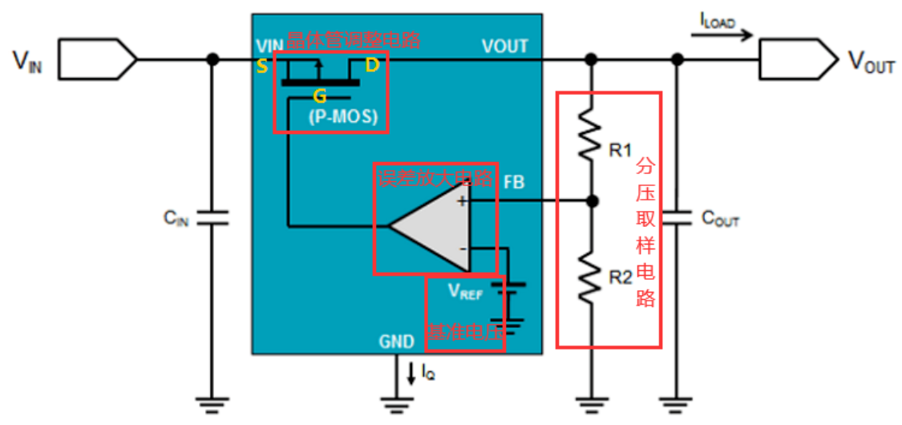

LDO内部基本都是由4大部件构成，分别是分压取样电路、基准电压、误差放大电路和晶体管调整电路。

**分压取样电路**： 通过电阻R1和R2对输出电压进行采集；

**基准电压**： 通过带隙电压基准产生的，温度变化对基准的影响小；

**误差放大电路**： 将采集的电压输入到比较器反向输入端，与正向输入端的基准电压（也就是期望输出的电压）进行比较，再将比较结果进行放大；

**晶体管调整电路**： 把这个放大后的信号输出到晶体管的控制极（也就是PMOS管的栅极或者PNP型三极管的基极），从而这个放大后的信号（电流）就可以控制晶体管的导通电压了，这就是一个负反馈调节回路。

反馈回路
当输出电压Vout由于负载变化或其他原因电压下降时，两个串联分压电阻两端的电压也会下降，进而A点电压下降，A点电位和基准电压Vref电位相比较，误差放大器会减小它的输出，使得PMOS管G极电压下降，PMOS管Vs电压不变，进而使得∣Vgs∣的压差增加（我们用Vgs和Vds的绝对值描述PMOS更直观），Isd会增加，输出电流Iout 增加就会使得输出电压Vout 上升，完成一次反馈控制，使得Vout 又回到正常电位。
过程如下：
$$
V_{out}↓ — — > V_A↓ — — >V_G↓ — — > I_{out}↑ — — > V_{out}↑ 
$$
当输出电压Vout增大时，A点电压VA增大，放大器输出电压增加，PMOS管的G极电压Vg增大，Vgs减小，PMOS的输出电流Isd减小，输出电压Vout减小。过程如下：
$$
V_{out}↑——>V_{A}↑——>V_{G}↑——I>_{out}↓——>V_{out}↓
$$

## 开关电源

上面我们介绍了LDO，但是LDO只能运用于低压差、低功率、小电流的电路，例如单片机供电等，而在面对高功率、高压差、大电流的应用场景时，就不能yongLDO来进行降压稳压了，此时就需要用到开关电源。在RM的应用场景中，应用更广泛的是脉冲调制非隔离式DCDC稳压开关电源，下文中无特殊注释，所说的DCDC开关电源均指脉冲调制非隔离式DCDC稳压开关电源。

我们要学习的DCDC开关电源大致有三种类型：降压电路（Buck）、升压电路（Boost）、双向升降压电路（Buck Boost）

接下来我将按顺序进行这三种电路的讲解。

### 降压电路（Buck）

在前面我们对于H桥的电机调速部分的讲解中，我曾讲解过PWM的运作方式，简单来说就是产生一个0和1不断跳变的方波，然后对整体求平均，通过对接通和断开时间的控制可以控制输出电压。具体可见上面我讲解H桥电机调速的部分。那么我们能不能使用PWM波完成降压工作呢？答案肯定是可以的，但是如果直接给负载上面加PWM波的话，就相当于让负载处于一个不断跳变的电信号之下，这样肯定是不行的，那我们就需要其它元件加以辅助。这里很多同学肯定会想到电容的滤波作用，我们来画出他的拓扑分析一下。

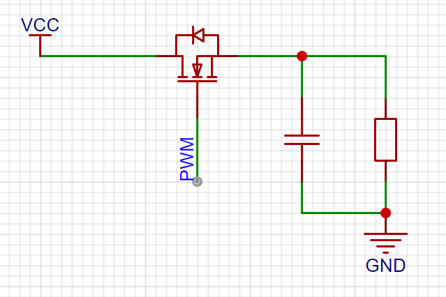

我们知道NMOS高电平导通，低电平关断，用PWM来控制MOS关断就相当于给负载加以PWM波，图中右端电阻表示负载。

此时，我们加上一个滤波电容，很简单就能分析出来，这个电容确实有效减少了电信号的突变，当PWM=1时，电源给负载供电，也给电容充电；当PWM=0时，电容放电，给负载供电。乍一看好像没什么问题，但我们仔细分析一下，我们知道电容有一个很重要的特性—电容两端电压不突变，但在这个电路里面，当PWM在0和1之间跳变时，电容两端的电压很明显是跳变的，电容为了抵抗这种跳变，就会产生非常大的电流，这样的大电流反之会导致充电速度过快，也有可能会导致MOS管损坏。因此我们还应该借助一个元件让电容两端电流不再过大。那我们也知道电阻可以起到限流作用，可不可以加一个电阻呢，显然不行，电阻会消耗能量，反而削弱了整个电路的作用。因此我们需要一个既能限流又不消耗能量的器件，那就是电感。我们知道电感本身就起到储能作用，而且有通直隔交、两端电流无法突变的特性，正好满足我们的要求。因此我们的拓扑就变成了下图所示：

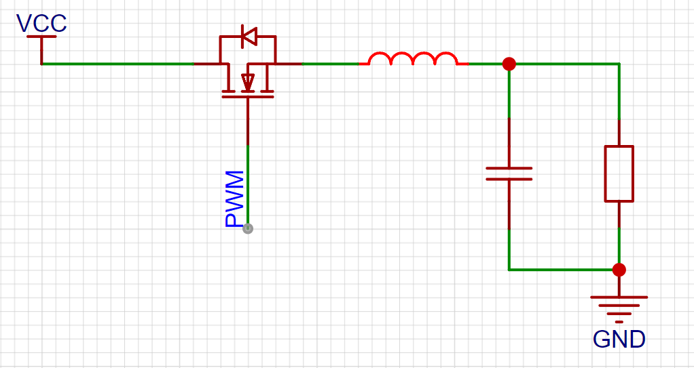

电感的存在可以让较大的电流缓慢变换，达到了限流的目的。但此时我们还有一个问题，我们知道电感电流不突变，但是当PWM波=0时，电流也会变成0，对抗这个突变的电流，电感会产生一个非常大的电压，又会损坏MOS管。在前面我们讲解H桥时，我们知道电感中的电流需要续流，因此我们要给电感一个回路，但是不能直接加这个回路，这样会导致电源直接入地，因此我们需要加一个二极管防止电源直接入地。拓扑就变成了如下所示：

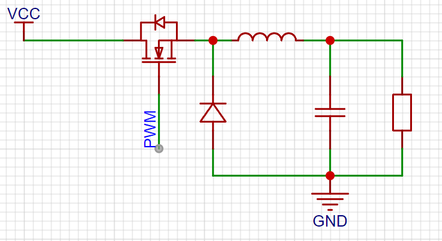

当PWM=1时，电信号通过电感到达电容和负载，PWM=0时，电信号会在电感、电容、电阻之间产生回路，就完成了降压过程。这便是Buck降压的基本拓扑。我们可以将该电路分为两大部分：即方波产生部分和LC滤波部分。后面的电感和电容组成了LC滤波，结合了电感的两端电流不突变和电容的两端电压不突变的特性，完成对PWM波的均值过程。下图是Buck降压的基本拓扑：

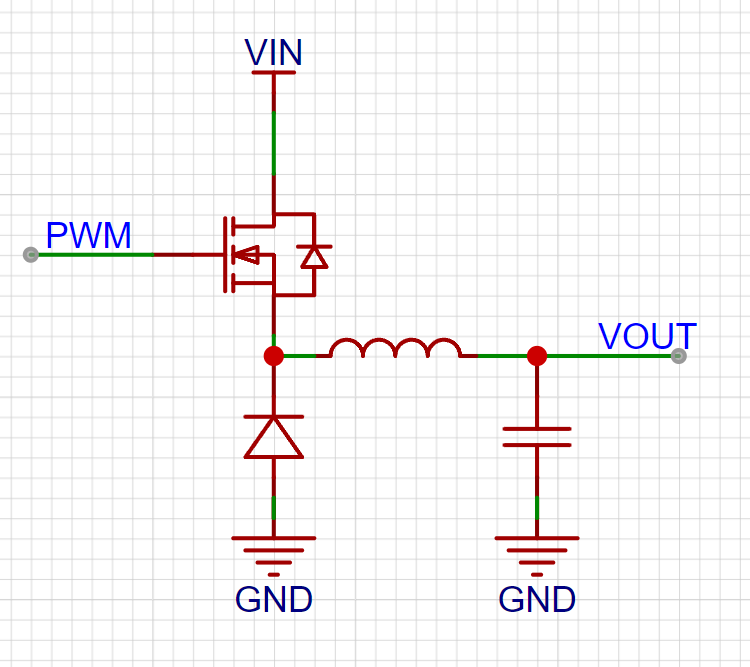

我们也可以用同样的MOS管来代替下面的二极管，只要让输入下管的PWM波和上管正好相反即可，也就是半桥结构，拓扑如下：

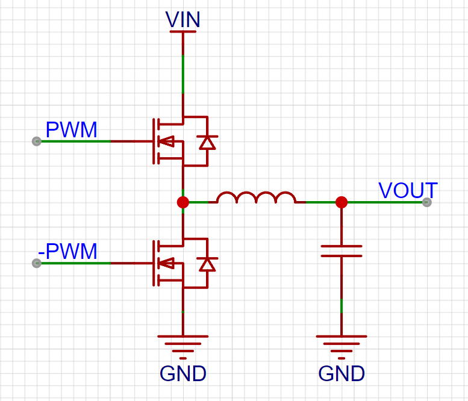

这种使用MOS管代替二极管的拓扑称为同步Buck拓扑，使用二极管的叫做异步Buck拓扑。

#### 相关数据计算

以下计算为推导，在实际应用时优先以数据手册给出的为准。

##### 占空比计算

$$
对于电感，我们知道：U_L=L\frac{\mathrm{d}i}{\mathrm{d}t}
\\
当MOS管导通时，U_{L(on)}=V_{in}-V_{out}
\\
\frac{\mathrm{d}i_{L(on)}}{\mathrm{d}t}=\frac{1}{L}(V_{in}-V_{out})
\\
\Delta i_{L(on)}=\int_{0}^{T_{on}}\frac{1}{L}(V_{in}-V_{out})\mathrm{d}t=\frac{T_{on}(V_{in}-V_{out})}{L}
\\
当MOS管关断时，U_{L(off)}=-V_d-V_{out}
\\
\frac{\mathrm{d}i_{L(off)}}{\mathrm{d}t}=\frac{1}{L}(-V_d-V_{out})
\\
\Delta i_{L(off)}=\int_{T_{on}}^{T_s}\frac{1}{L}(-V_d-V_{out})\mathrm{d}t=\frac{(V_d+V_{out})(T_s-T_{on})}{L}
\\
由电感的电流增加量与减少量相等，即i_{L(on)}=i_{L(off)}
\\
\frac{T_{on}(V_{in}-V_{out})}{L}=\frac{(V_d+V_{out})(T_s-T_{on})}{L}
\\
化简可得\frac{V_{out}}{V_{in}}=\frac{T_{on}}{T_s}=D
$$

##### 电感取值计算

$$
由U_L=L\frac{\mathrm{d}i}{\mathrm{d}t}可得
\\
当MOS管导通时，U_{L(on)}=V_{in}-V_{out},L=U_{L(on)}\frac{\mathrm{d}t}{\mathrm{d}i}=\frac{TD(V_{in}-V_{out})}{\Delta i_{L(on)}}
\\
当MOS管关断时，U_{L(off)}=-V_d-V_{out},L=U_{L(off)}\frac{\mathrm{d}t}{\mathrm{d}i}=\frac{T(1-D)(-V_d-V_{out})}{\Delta i_{L(off)}}
\\
上述为详细电感值计算公式，而在应用中，我们更多用的公式为：
\\
L=\frac{V_{out}(1-D)}{\Delta i\cdot f}
\\
上述取值为临界电感值，实际应用中电感值不应小于临界电感值。
$$

##### 电容取值计算

$$
对于电容，我们知道C=\frac{\Delta Q}{\Delta U}
\\
假设电容在\frac{t}{2}时充电，\Delta Q=\int_{t_{on}/2}^{t_s/2}i_c\mathrm{d}t,i_c=i_L-i_{out}
\\
我们可以画图得，\Delta Q=\frac{T_{on}}{2}\times \frac{\Delta i_L}{2}\times \frac{1}{2}+\frac{T_{off}}{2}\times \frac{\Delta i_L}{2}\times \frac{1}{2}=\frac{1}{8}\Delta i_LT
\\
C=\frac{\Delta Q}{\Delta U}=\frac{\Delta i_LT}{8\Delta U_o}=\frac{\Delta i_L}{8f\Delta U_o}
$$

#### 集成BUCK降压芯片的应用

在我们日常设计中，很多时候并不需要我们自己搭建buck的拓扑，使用集成芯片即可。下图是德州仪器的TPS5450芯片，芯片把拓扑中的mos管和PWM生成器集成到了芯片中，我们可以通过改变后面两个电阻的值来改变降压幅度。

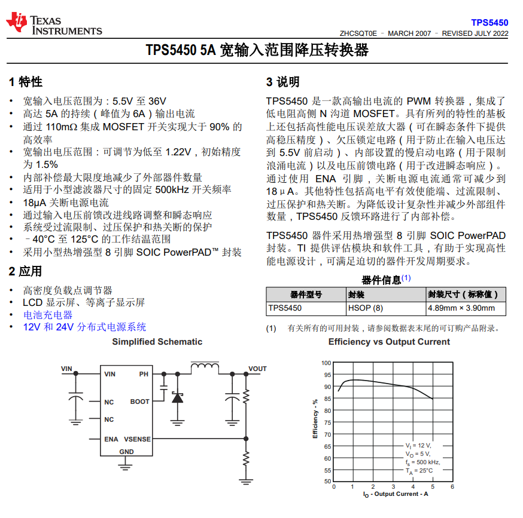

下图为典型应用示例，再上图也给出了电路，各元器件的取值也在参考手册里面给出了公式，优先使用用户手册里的计算公式。

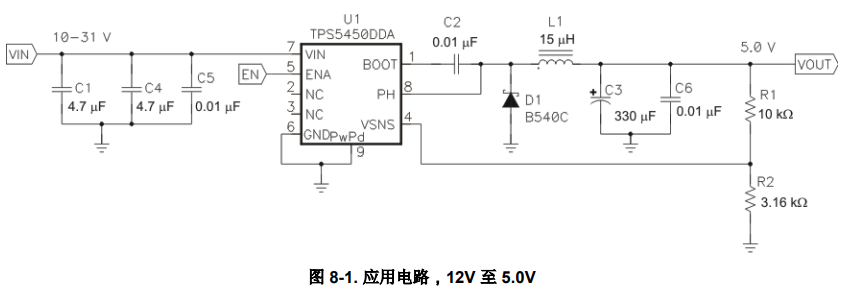

### 升压电路（Boost）

在前面高边MOS自举电路的学习中，我们知道可以通过自举电容把电压抬高，具体就是自举电容同时获得电源和感性元件的电压将电压抬高的过程，因此我们也可以用电感的储能功能和电源原本的电压叠加完成升压电路，具体的拓扑如下所示：

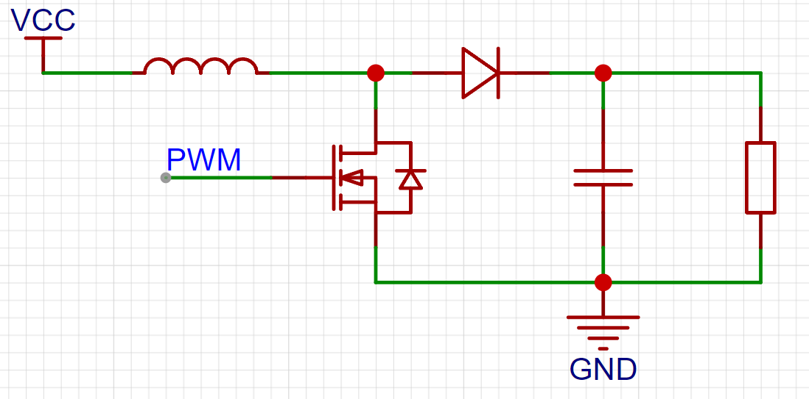

上图中，电感为储能元件，通过PWM控制MOS通断控制电感的充能与释放，和Buck一样，Boost电路也可以通过控制PWM波占空比来调整升压幅度。下面我们对该电路进行详细的分析：

**PWM=1时：**

MOS管闭合，此时等效电路如下：

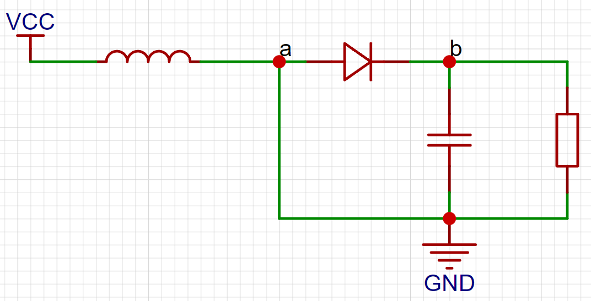

此时电源与电感形成回路，电感充电；

电容在上次断开时已经被充电，闭合后电容电压不突变，V~C~=V~L~+V~in~-V~D~，V~b~=V~C~，而V~a~=0，V~b~>V~a~，二极管关断，此时电感充电，而电容维持释放电压，V~out~=V~C~。

**PWM=0时：**

MOS管关断，此时等效电路如下：

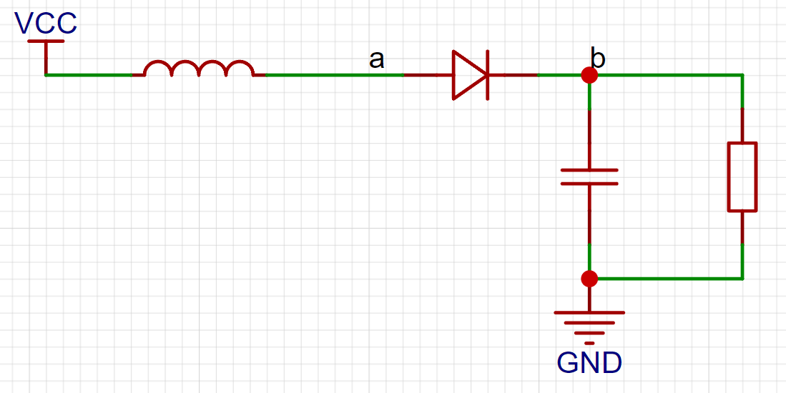

此时电源与电感无法形成完整回路，电感不再充电，转为持续放电给电容充电；

由于电感通直阻交的特性，电源继续给电容充电，电容电压V~C~=V~L~+V~in~-V~D~，完成升压过程。

在上述过程中，V~L~的大小取决于充电时间，因此控制PWM占空比可以控制升压幅度。

和Buck电路一样，此处的二极管也可换成MOS管，电路如下：

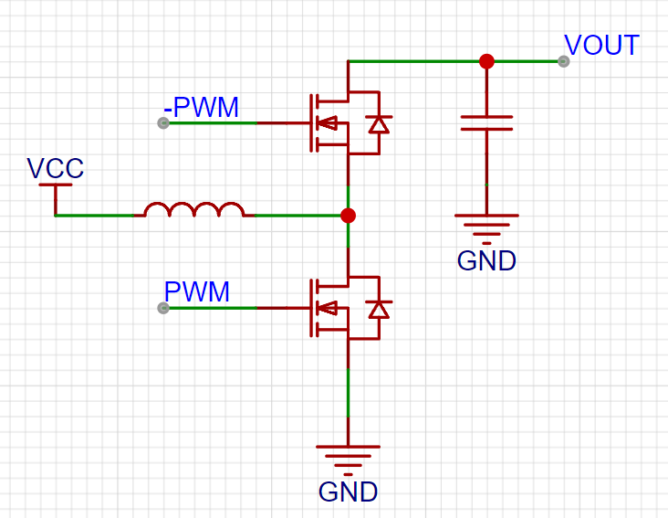

这种使用MOS管代替二极管的拓扑称为同步Boost拓扑，使用二极管的叫做异步Boost拓扑。

#### 相关数据计算

以下计算为推导，在实际应用时优先以数据手册给出的为准。

##### 占空比计算

$$
当MOS管导通时，U_{L(on)}=V_{in}
\\
\frac{\mathrm{d}i_{L(on)}}{\mathrm{d}t}=\frac{V_{in}}{L}
\\
当MOS管关断时，U_{L(off)}=V_{in}-V_{out}
\\
\frac{\mathrm{d}i_{L(off)}}{\mathrm{d}t}=\frac{V_{in}-V_{out}}{L}
\\
由电感的电流增加量与减少量相等，即i_{L(on)}=i_{L(off)}
\\
\frac{V_{in}T_{on}}{L}=\frac{(V_{in}-V_{out})(T_{s}-T_{on})}{L}
\\
化简可得，\frac{V_{out}-V_{in}}{V_{out}}=\frac{T_{on}}{T_s}=D
$$

##### 电感取值计算

$$
由U_L=L\frac{\mathrm{d}i}{\mathrm{d}t}可得
\\
当MOS管导通时，U_{L(on)}=V_{in},L=U_{L(on)}\frac{\mathrm{d}t}{\mathrm{d}i}=\frac{TDV_{in}}{\Delta i_{L(on)}}
\\
当MOS管关断时，U_{L(off)}=V_{in}-V_{out},L=U_{L(off)}\frac{\mathrm{d}t}{\mathrm{d}i}=\frac{T(1-D)(V_{in}-V_{out})}{\Delta i_{L(off)}}
\\
上述为详细电感值计算公式，而在应用中，我们更多用的公式为：
\\
L=\frac{V_{in}(1-D)}{\Delta i\cdot f}
\\
上述取值为临界电感值，实际应用中电感值不应小于临界电感值。
$$

##### 电容取值计算

$$
对于电容，我们知道C=\frac{\Delta Q}{\Delta U}
\\
假设电容在\frac{t}{2}时充电，\Delta Q=\int_{t_{on}/2}^{t_s/2}i_c\mathrm{d}t,i_c=i_L-i_{out}
\\
我们可以画图得，\Delta Q=\Delta i_L(1-D)T
\\
C=\frac{\Delta Q}{\Delta U}=\frac{\Delta i_LT(1-D)}{\Delta U_o}=\frac{\Delta i_L(1-D)}{f\Delta U_o}
$$

#### 集成BOOST升压芯片的使用

与buck相同，在我们日常设计中，很多时候并不需要我们自己搭建boost的拓扑，使用集成芯片即可。下图是德州仪器的TPS6104芯片，芯片把拓扑中的mos管和PWM生成器集成到了芯片中，我们可以通过改变后面两个电阻的值来改变升压幅度。

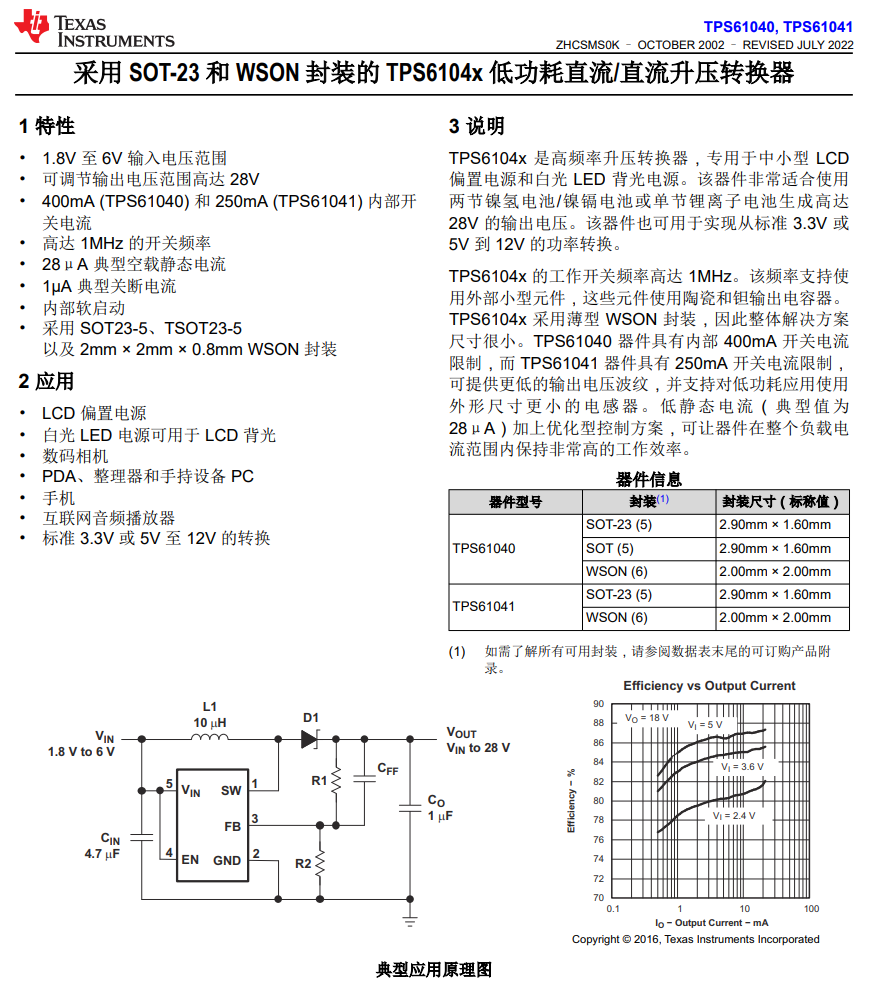

下图为典型应用示例，再上图也给出了电路，各元器件的取值也在参考手册里面给出了公式，优先使用用户手册里的计算公式。

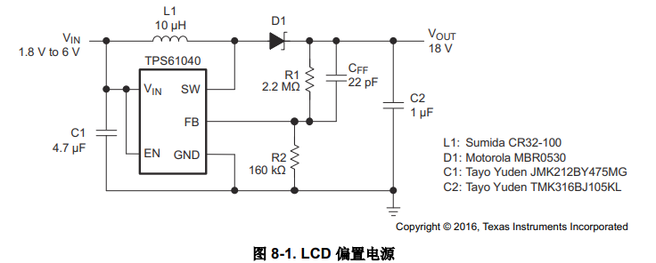

### 双向四开关Buck-Boost升降压电路

在上面，我们学习了Buck电路和Boost电路，并且我们知道这两个电路都可以使用半桥拓扑。同样的，假设一切条件全部理想，将Buck电路的前半段与Boost电路的后半段相连，我们可得到如下的四开关双向Buck-Boost电路。该拓扑即为我们超级电容控制板的基本拓扑。

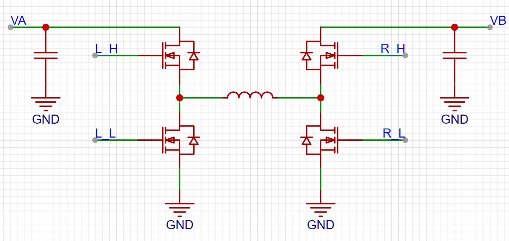

可见，该拓扑为H桥电路，但其控制模式比控制电机的H桥电路要复杂的多，接下来我们进行详细的分析：

**若电流由左向右流动：**

- 将R_H常导通，R_L常断开，L_H和L_L使用Buck电路的PWM控制策略，则等效电路图如下图。

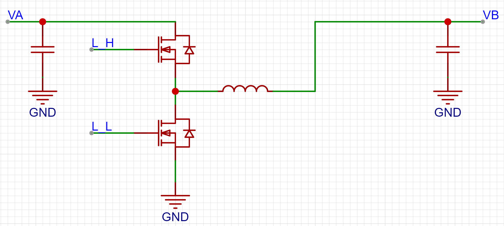

​	该电路完全等效于Buck的拓扑，此时可将电路看作Buck电路。

- 将L_H常导通，L_L常断开，R_H和R_L使用Boost电路的PWM控制策略，则等效电路图如下图。

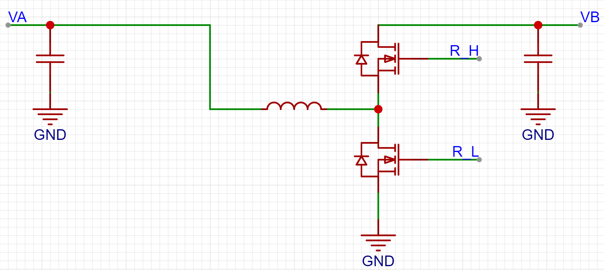

​	该电路完全等效于Boost的拓扑，此时可将电路看作Boost电路。

- 第三种情况是需要的左电压与右电压相近。此时实际应用中由于最大占空比以及死区时间等限制，很难单独使用Buck或者Boost拓扑生成所需电压比。于是考虑用Buck控制策略控制左半桥，用Boost控制策略控制右半桥，此即为buck-boost电路。在任意时刻（瞬时），电路可视为Buck电路或Boost电路。为了防止两边的下管同时导通，左右两边的上管占空比应相互制约，同时相位也应错开。此时，无论是使用叠加原理还是通过伏秒平衡定律，我们都可以得到V~A~/V~B~=D~B~/D~A~，其中，D~A~为左侧上管占空比，D~B~为右侧上管占空比。

**若电流由右向左流动：**

由于电路完全对称，显然，仅需将Buck与Boost颠倒过来，即可实现与上述完全相同的效果。

经过同样的推导，我们仍然得到此结果 V~A~/V~B~=D~B~/D~A~。

在控制这个四开关双向Buck-Boost电路时，实际上**不需要区分电路到底是Buck还是Boost**，也不需要关注电流的流向等，只需给予两个半桥合适的占空比，即可获得想要的左右电压之比。这种不对电流流向做限制，强制上下管交替导通的控制方式被称为FPWM（强制脉宽调制）模式。由于实现此控制模式的硬件较为简单，本设计采用此控制模式进行控制。

> Buck与Boost的互相转换只在 *同步Buck/同步Boost* 中起作用。

#### 相关数据计算

##### 电感数值计算

$$
Buck模式下工作时，电感取值应满足L_{Buck}>\frac{V_{out}(1-D)}{\Delta i\cdot f}。其中，D为上管占空比。 
 \\
 分析可得，当输入电压最大时，占空比为0.5时上式右侧取得最大值。
 \\
 Boost模式下工作时，电流流向反转，将上述公式中的V_{out}输出电压换为V_{in}输入电压，即得到L_{Boost}>\frac{V_{in}(1-D)}{\Delta i\cdot f}
 \\
 分析可得，当输出电压最大时，占空比为0.5时上式右侧取得最大值。
$$

##### 电容数值计算

$$
Buck模式下工作时，电容取值应满足C_{Buck}>\frac{\Delta i_L}{8f\Delta U_o}
\\
Boost模式下工作时，电容取值应满足C_{Boost}>\frac{\Delta i_LT(1-D)}{\Delta U_o}=\frac{\Delta i_L(1-D)}{f\Delta U_o}
$$

# 六、后记

至此，我们的知识储备已经足够我们大致看懂超级电容控制板的构成了，但是上面我讲的东西大部分都是针对新手来说的，许多细节并没有进行过于细致的讲解，真正自己设计一款超级电容需要非常多的知识和经验积累，并不是大一大二学习两年就能做出来的，下面我也对超级电容控制板进行一个大致的剖析：

常见的超级电容控制板由电源、功率部分、控制部分和采样部分组成。

**电源：**RM官方的电源为24V直流电源，我们需要将24V通过降压模块给控制部分的单片机等各种模块供电。

**功率部分：**即前面我们讲解过的双向四开关Buck-Boost升降压电路，这种拓扑比以前的纯Buck方案能量利用率要高得多。

**控制部分：**包括单片机、CAN通信模块、MOS驱动模块、信号调理电路等。

**采样部分：**包括电流采样和电压采样，通过ADC向单片机发送信号，进行反馈。

其他细节可以参考各队伍的超级电容开源，也可以参考笔者日后设计的超级电容开源，开源文档里更加为详细。

此文档于2024年9月27日结束撰写，包括了从0开始学习制作超级电容的大部分知识点，我自认为写的并不算特别详细，在RM24赛季之前，我们战队并没有一个真正的硬件组，只是有不同的人在学习硬件知识，并进行着硬件的开发，直到24赛季，才有了真正意义上的硬件组，也有了我们的第一个自研超级电容控制板，在这里特别感谢齐奇战队的张霄宁学长和崔景辉学长，崔景辉学长为我们战队带来了第一版自研超电；张霄宁学长带我从硬件入门到精通，我的大部分知识都来自这位学长。也感谢山东理工大学齐奇战队的所有人的付出，没有他们，笔者也没有一个正式的平台去做硬件和学习硬件开发，齐奇战队的各位是我写下这个文档的动力。

同时也感谢香港科技大学ENTERPRIZE战队、西交利物浦GMastr战队、大连理工大学凌_BUG战队等众多优秀队伍的优秀开源，这些开源让我受益匪浅。

最后，祝看到这篇文章的大家能在RM取到好的成绩，有让自己满意的成果，最重要的是收获技术的乐趣。

